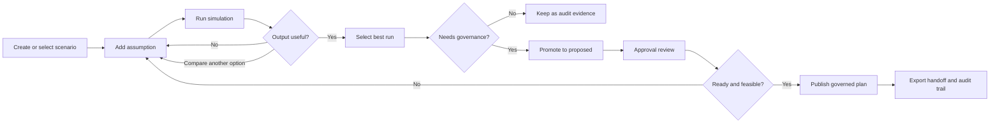

# 16 - Phase 2 Scenario Operator Guide

## Purpose

This guide explains the Phase 2 seeded what-if scenarios in operator language. It is written for an operator who wants to understand what each scenario represents, what to look for in the Simulation Workspace, and how to build a similar what-if manually.

Use this guide with the full pilot demonstration seed:

```text
docker compose run --rm -e RUN_STARTUP_TASKS=0 api python manage.py seed_phase0 --reset-operational-data
```

Then open:

```text
http://localhost:8080
```

Log in as `admin@coalflow.local` for UAT, or as an operating role with schedule edit and simulation permissions.

## How the Simulation Workspace should be read

Open **Recovery Loop -> Simulation Workspace**.

The screen has four operator jobs:

1. Select a scenario from the scenario list.
2. Review the assumptions that define the what-if.
3. Run the scenario and inspect the calculated outputs.
4. Promote only the selected run that is worth sending into governance.

The simulation does not silently edit the live plan. It creates projected trip starts, completions, constraint checks, resource utilization, OGV impact, and impact-chain nodes. The live plan changes only after a promoted scenario goes through approval and publishing.

Use these fields as the main operating signals:

| Signal | Meaning |
|---|---|
| Active scenario | The what-if case currently selected |
| Selected run | The calculated run currently being inspected |
| Changed trips | Number of trips whose projected start/end/resource changed |
| Max delay | Largest projected trip delay in the selected run |
| Risk flags | Remaining critical/warning constraint results |
| Baseline vs scenario output | Row-by-row comparison between current plan and what-if projection |
| Computed timeline | Visual comparison of baseline lane and scenario lane |
| Constraint evaluations | Tide, bridge, asset, sequence, and other projected risk checks |
| Run ledger | Multiple calculated runs for the same scenario, useful before promotion |

## General steps to build a manual what-if

Use these steps for any scenario below:

1. Open **Recovery Loop -> Simulation Workspace**.
2. In **New scenario**, enter a short name such as `Operator jetty delay test`.
3. Click **Create manual**.
4. In **Assumption editor**, select the assumption **Kind**.
5. Fill the fields for that assumption.
6. Click **Add assumption**.
7. Click **Run simulation**.
8. Review **Changed trips**, **Max delay**, **Risk flags**, the baseline-vs-scenario table, the timeline, and constraint evaluations.
9. Add another assumption and run again if the first what-if is not enough.
10. Click **Promote to proposed** only when the selected run should enter approval governance.

If the selected scenario is already `PROPOSED` or `CANCELED`, it is locked. Create a new manual scenario instead of editing the locked scenario.

## Scenario 1 - `SIM-JETTY-DELAY`

### Business meaning

This scenario represents a jetty loading start delay. In a real operation, this can happen when a barge is ready but the jetty is not ready, the loader is delayed, a safety clearance is late, or the berth is still occupied.

The seeded scenario applies a 120 minute delay to the first planned trip. The important question is not only "is the first trip late?" The important question is whether the late loading start pushes the convoy into a missed tide/bridge window, delays downstream CTS arrival, or creates a later handoff risk.

### What to verify in the seeded scenario

Select `SIM-JETTY-DELAY` and inspect:

- **Assumptions** should show `TRIP DELAY` with `+120m`.
- **Max delay** should show a visible delay.
- **Baseline vs scenario output** should show scenario start/completion later than baseline.
- **Constraint evaluations** should show whether tide or bridge risk worsened.
- If promoted, **Plan Approvals & Publishing** should show scenario source lineage for `SIM-JETTY-DELAY`.

### How to build it manually

1. Create a manual scenario named `Operator jetty delay test`.
2. Set **Kind** to **Trip delay**.
3. Select the first trip in the trip dropdown.
4. Set **Delay minutes** to `120`.
5. Click **Add assumption**.
6. Click **Run simulation**.
7. Compare baseline start/completion against scenario start/completion.

Use a larger delay such as `240` minutes if you want to test a stronger disruption.

## Scenario 2 - `SIM-TUG-OUTAGE`

### Business meaning

This scenario represents a tug becoming unavailable during the operating window. In real life, this can be caused by mechanical breakdown, crew availability, fuel issue, inspection hold, or a tug being pulled into a higher priority movement.

The seeded scenario makes the first tug unavailable for a short window overlapping the early plan. The simulation checks how that outage affects the trip chain, resource availability, and projected schedule.

### What to verify in the seeded scenario

Select `SIM-TUG-OUTAGE` and inspect:

- **Assumptions** should show `ASSET OUTAGE`.
- The assumption payload should reference a tug asset, typically `BER-TUG-08`.
- The baseline-vs-scenario table should show whether trips are delayed or reassigned.
- Resource utilization should show the affected tug/barge pressure.
- Constraint evaluations should show whether the delay creates a downstream risk.

### How to build it manually

1. Create a manual scenario named `Operator tug outage test`.
2. Set **Kind** to **Asset outage**.
3. Set **Asset code** to `BER-TUG-08`.
4. Set **Effective from** to a time overlapping the selected trip start.
5. Set **Effective to** around three hours later.
6. Click **Add assumption**.
7. Click **Run simulation**.

If nothing changes, widen the outage window or use the tug shown in the selected trip's baseline chain.

## Scenario 3 - `SIM-TIDE-RECOVERY`

### Business meaning

This scenario represents a tighter or shifted tide/bridge operating window. In real operations, the tide forecast may move, bridge clearance may be restricted, river conditions may change, or a navigation authority may shorten the allowed crossing period.

The seeded scenario changes an active tide window so that the planned movement is evaluated against a more difficult gate. This tests whether the trip can still cross inside the navigational window.

### What to verify in the seeded scenario

Select `SIM-TIDE-RECOVERY` and inspect:

- **Assumptions** should show `WINDOW CHANGE`.
- Constraint evaluations should include tide or bridge checks.
- The impact panel should explain whether a gate was missed or remains acceptable.
- The timeline should help the operator see whether the projected movement lands inside or outside the window.

### How to build it manually

1. Open **Constraints -> Tide & Bridge Window** in another browser tab or note the visible tide/bridge window code.
2. Return to **Recovery Loop -> Simulation Workspace**.
3. Create a manual scenario named `Operator tide recovery test`.
4. Set **Kind** to **Window change**.
5. Enter the tide or bridge **Window code** exactly as shown in the constraints page.
6. Set **Effective from** and **Effective to** to a narrower period than the current window.
7. Click **Add assumption**.
8. Click **Run simulation**.

A useful test is to make the window end before the planned crossing. That should create a visible missed-window or warning result.

## Scenario 4 - `SIM-CTS-RATE`

### Business meaning

This scenario represents lower CTS or floating crane productivity. In real operations, this can happen because of equipment derate, weather interruption, hatch handling delays, maintenance, or reduced crew/equipment availability.

The seeded scenario lowers the CTS rate to `950 TPH` for the selected operating period. The simulation shows how slower discharge affects completion time, OGV readiness, and downstream demurrage or laycan risk.

### What to verify in the seeded scenario

Select `SIM-CTS-RATE` and inspect:

- **Assumptions** should show `RATE CHANGE`.
- The asset code should point to a CTS or floating crane, such as `CTS-BORNEO`, `CTS-JAVA`, or `FC-CHLOE`.
- Completion times should move later if the affected asset is in the active chain.
- OGV projections should show whether completion risk changed.
- Resource utilization should show extra occupancy or waiting time.

### How to build it manually

1. Create a manual scenario named `Operator CTS rate test`.
2. Set **Kind** to **Rate change**.
3. Set **Asset code** to `CTS-BORNEO` or the CTS shown in the trip chain.
4. Set **Rate TPH** to `950`.
5. Set **Effective from** to the expected CTS operating start.
6. Set **Effective to** to a later time covering the discharge operation.
7. Click **Add assumption**.
8. Click **Run simulation**.

Try `700` TPH for a severe degradation test.

## Scenario 5 - `SIM-TOPUP-DEMAND`

### Business meaning

This scenario is a top-up demand pressure proxy. It represents the operational effect of new or changed demand arriving on top of the current plan. In the current Phase 2 implementation, it does not create a brand-new cargo demand row by itself. Instead, it models the queue pressure by delaying the last trip and changing the related OGV ETA.

Use this scenario to understand how additional demand pressure can affect the tail of the plan before a richer demand-generation workflow is added in a later phase.

### What to verify in the seeded scenario

Select `SIM-TOPUP-DEMAND` and inspect:

- **Assumptions** should include `TRIP DELAY` and `OGV ETA CHANGE`.
- Changed trips should focus near the end of the chain.
- OGV projections should show whether the ETA/completion relationship changes.
- The baseline-vs-scenario output should make the late-plan effect visible.

### How to build it manually

1. Create a manual scenario named `Operator top-up pressure test`.
2. Add the first assumption:
   - **Kind**: **Trip delay**
   - **Trip**: select the last visible trip
   - **Delay minutes**: `90`
3. Click **Add assumption**.
4. Add the second assumption:
   - **Kind**: **OGV ETA change**
   - **OGV**: select the OGV tied to the last trip
   - **New ETA**: set it several hours later than the current ETA
5. Click **Add assumption**.
6. Click **Run simulation**.

If the goal is to test a true new demand intake, use **Planning -> OGV Demand & Laycan -> Import demand**, then create a successor draft from the published plan and regenerate. That is a planning-flow test, not this scenario assumption test.

## Scenario 6 - `SIM-MANUAL-REASSIGNMENT`

### Business meaning

This scenario tests an operator-driven reassignment. In real operations, the dispatcher may choose a different tug or barge because the planned asset is late, has a maintenance issue, is needed elsewhere, or has better suitability for a constrained movement.

The seeded scenario changes the tug on a selected assignment. It is meant to verify that a manual asset change is not just a note, but is included in the projected chain and visible in the baseline-vs-scenario comparison.

### What to verify in the seeded scenario

Select `SIM-MANUAL-REASSIGNMENT` and inspect:

- **Assumptions** should show `MANUAL REASSIGNMENT`.
- The baseline-vs-scenario chain should show a resource change.
- Resource utilization should reflect the changed tug or barge pressure.
- Constraint evaluations should confirm whether the reassigned chain is still feasible.

### How to build it manually

1. Create a manual scenario named `Operator reassignment test`.
2. Set **Kind** to **Manual reassignment**.
3. Select an **Assignment** from the dropdown.
4. Enter a replacement **Tug code**, for example `BER-TUG-09`.
5. Optionally enter a replacement **Barge code**, for example `BRG-NUS-17`.
6. Click **Add assumption**.
7. Click **Run simulation**.

Use a tug/barge code that exists in **Admin Console -> Master Data Console**. If the chain does not change, choose the assignment that currently uses a different tug/barge than your replacement.

## Scenario 7 - `SIM-MULTI-CANDIDATE`

### Business meaning

This scenario demonstrates that operators can compare more than one recovery candidate before promotion. In real planning, the first answer is often not the final answer. A dispatcher may test a mild delay, then a stronger delay, then a reassignment, and only promote the run that has the best operational tradeoff.

The seeded scenario has two runs:

| Run | Meaning |
|---|---|
| `RUN-SIM-MULTI-CANDIDATE-01` | first candidate with a 60 minute delay |
| `RUN-SIM-MULTI-CANDIDATE-02` | second candidate after adding a 120 minute delay |

### What to verify in the seeded scenario

Select `SIM-MULTI-CANDIDATE` and inspect:

- The run ledger should show at least two runs.
- The two runs should have different max delay values.
- Selecting different runs should change the projected output.
- The operator should promote only the run that should enter governance.

### How to build it manually

1. Create a manual scenario named `Operator multi candidate test`.
2. Add a **Trip delay** assumption:
   - select a mid-chain trip;
   - set **Delay minutes** to `60`;
   - click **Add assumption**.
3. Click **Run simulation**. This is candidate run 1.
4. Add another **Trip delay** assumption:
   - select an earlier trip;
   - set **Delay minutes** to `120`;
   - click **Add assumption**.
5. Click **Run simulation** again. This is candidate run 2.
6. Use the run ledger to compare the two runs.
7. Promote only the selected run that should be reviewed by Berau and ABL.

## Operator acceptance checklist

Use this checklist after testing any scenario:

- The scenario has a clear business trigger.
- At least one assumption is visible in the scenario.
- **Run simulation** creates or updates a selected run.
- **Changed trips** and **Max delay** match the expected direction of impact.
- Baseline and scenario times are both visible.
- Constraint evaluations show whether tide, bridge, asset, or sequence risk changed.
- OGV projections and resource utilization are reviewed when relevant.
- The operator can explain why this run should or should not be promoted.
- Promotion is not used as publication; it only creates a proposed plan requiring governance.

## What next after scenarios exist?

Once a scenario exists, the operator's job changes from building the what-if to deciding what the organization should do with it. A scenario is not automatically a recovery plan. It is a calculated candidate that must be interpreted, compared, and either rejected, refined, or sent into governance.

Use the following decision flow.

### Step 1 - Confirm the scenario answers a real operating question

Before spending time on the output, confirm the scenario is tied to a real decision:

| Question | Example |
|---|---|
| What happened or might happen? | Jetty delay, tug outage, tight tide gate, CTS rate loss |
| Which trip, OGV, asset, or window is affected? | `PI-...-0001`, `BER-TUG-08`, `CTS-BORNEO`, `TIDE-...` |
| What does the operator need to decide? | Wait, reassign, adjust timing, escalate, or create a successor plan |
| Is this current execution recovery or future planning? | Current recovery belongs in Simulation Workspace; new demand belongs in planning/top-up flow |

If the scenario is only a vague concern, refine the assumption before running it.

### Step 2 - Run the scenario and read the first-level outcome

After clicking **Run simulation**, read these in order:

1. **Changed trips**: shows the operational spread of the disruption.
2. **Max delay**: shows the largest direct trip delay.
3. **Risk flags**: shows whether the scenario creates critical or warning conditions.
4. **Baseline vs scenario output**: confirms exactly which trip timings or resources changed.
5. **Constraint evaluations**: confirms whether the movement still fits tide, bridge, sequence, asset, and other rules.

The operator should be able to say one sentence such as:

```text
This candidate delays six trips by up to 120 minutes and leaves critical tide/bridge risk unresolved.
```

or:

```text
This candidate changes only one assignment and keeps navigational constraints acceptable.
```

### Step 3 - Decide whether to reject, refine, or compare

Do not promote the first scenario run by habit. Use this table:

| Result | Operator action |
|---|---|
| No meaningful change | Check whether the assumption targeted the correct trip/asset/window; then rerun |
| Delay is visible but acceptable | Keep as evidence; promotion may not be needed |
| Warning risk appears | Add a second assumption, such as reassignment or wider window, then rerun |
| Critical risk remains | Do not promote as final recovery unless governance intentionally needs to review a blocked candidate |
| Multiple options are plausible | Create another run in the same scenario or create another scenario |
| The scenario models a real recovery decision | Promote the best selected run to proposed |

For example, if `SIM-TUG-OUTAGE` delays the chain too much, the operator can add a **Manual reassignment** assumption and run again. That creates a more useful comparison than just accepting the outage result.

### Step 4 - Compare runs before promotion

The run ledger is important. It preserves different calculated attempts for the same scenario.

A practical comparison might look like this:

| Candidate | Assumptions | Operator interpretation |
|---|---|---|
| Run 1 | 60 minute trip delay | Mild disruption, maybe acceptable |
| Run 2 | 120 minute trip delay | More realistic disruption, but creates more risk |
| Run 3 | 120 minute delay plus tug reassignment | Recovery option, may reduce downstream delay |

Promote the run that best represents the recovery option the operator wants reviewed. The selected run, not just the scenario name, becomes part of the lineage.

### Step 5 - Promote only when governance should review it

Click **Promote to proposed** only when all of these are true:

- the scenario is based on a real operating decision;
- the selected run is the intended candidate;
- the operator understands the remaining risk;
- the candidate should be reviewed by Berau and ABL authorities;
- the live plan should not be directly edited outside governance.

Promotion creates a proposed plan version. It does not publish the plan.

After promotion, open **Schedule -> Plan Approvals & Publishing** and confirm:

- the approval request exists;
- the scenario source is visible;
- selected run lineage is visible;
- changed trip count and aggregate delay are visible;
- publish remains blocked if unresolved critical risk remains.

### Step 6 - Use approval outcome to decide the operating action

After promotion, the next action depends on governance:

| Governance result | What it means operationally |
|---|---|
| Approval pending | Berau/ABL review has not completed |
| Approved but publish blocked | The candidate still has unresolved blocking risk |
| Approved and ready to publish | The candidate can become the governed operating plan |
| Rejected | The operator should revise assumptions or choose another run |

If publish is blocked, do not force publication. Go back to the scenario, change assumptions, rerun, or create another recovery candidate.

### Step 7 - Export evidence when handing off

When a promoted scenario is being discussed across teams, open **Admin Console -> Exports & Handoff** and generate a scenario-diff export. The export is useful because it gives the review team:

- baseline plan reference;
- scenario candidate reference;
- selected run lineage;
- changed trips;
- delay deltas;
- checksum and audit evidence.

The export is not a replacement for approval. It is the governed evidence pack for review and handoff.

### Step 8 - Audit the decision trail

Open **Admin Console -> Audit & Logs** and confirm the key events exist:

- scenario creation;
- assumption creation;
- simulation run;
- promotion;
- approval action;
- export generation.

This is the evidence that the scenario was not a silent spreadsheet edit.

### Step 9 - Know when to leave Simulation Workspace

Some next actions should not be handled by scenario assumptions:

| Situation | Correct next workspace |
|---|---|
| A new OGV demand arrives | **Planning -> OGV Demand & Laycan** |
| A published plan needs a top-up successor draft | **Schedule -> Published Plan & Schedule -> Create draft** |
| Master data is wrong | **Admin Console -> Master Data Console** |
| A real jetty override has already happened | **Operations -> Jetty Loading** and **Exception Center** |
| A plan is ready for formal control-tower release | **Plan Approvals & Publishing** |
| A partner needs an evidence pack | **Exports & Handoff** |

Simulation Workspace is for consequence modeling and recovery comparison. Planning workspace is for demand creation and plan regeneration. Governance workspace is for approval and publication.

### Scenario lifecycle summary



## Current Phase 2 limits to remember

These what-ifs are calculated and auditable, but they are still Phase 2 scenario planning, not a full optimizer.

Current scope:

- single-plan what-if assumptions;
- deterministic scenario runs;
- baseline-vs-scenario trip projections;
- constraint evaluations;
- resource utilization projection;
- selected-run promotion;
- approval and export lineage.

Deferred to later phases:

- automatic best-plan optimization;
- full tug/barge fleet resequencing;
- automatic CTS queue optimization;
- true scenario-created demand rows;
- demurrage optimization;
- automatic recommendation ranking.
