# 28 - Phase 5 Recovery Operator Trial Runbook

## Purpose

This runbook documents the recovery-only operator trial. It starts from empty operational demand, imports the Phase 5 recovery OGV demand through the UI, creates the blocked plan through the UI, follows visible UI CTAs assisted by Next Action, validates the selected recovery path, resolves the blockers, completes Berau/ABL approval, runs publishability, and manually publishes the recovered plan.

This is not the clean happy path. The clean happy path proves ordinary planning from imported OGV demand. This recovery run proves that a disrupted plan cannot go to approval or publish until the recovery scenario has cleared blockers and the publishability gate accepts the root-cause outcome.

## Start Command

Run this once from `F:\ocean` before starting the UI trial:

```text
docker compose exec -T api python manage.py operator_trial_practice reset --json
```

What this command does:

- keeps users, permissions, master data, telemetry identities, and base operating reference data;
- clears demand, plans, recovery artifacts, approvals, publishability records, published snapshots, exports, and flow events;
- starts the `phase5_recovery_from_demand_v1` flow;
- sets flow metadata `trial_pack=operator_trial_phase5`, so the visible **Import demand** CTA imports the recovery trial pack instead of the clean happy-path pack.

Do not use `operator_trial_practice prepare-db-truth --flow recovery` for this operator run. That shortcut starts after the blocked plan already exists. Use only the reset command above, then run every business step from the UI.

## UI Runbook

Open `http://localhost:8080/#/dashboard/situation`, log in as `admin@coalflow.local` / `admin12345`, and set Assist mode to **SUPER**. Then follow **Next Action** unless the table explicitly says to review a page manually.

| Step | UI route | Operator action | Expected output |
|---:|---|---|---|
| 1 | `/schedule/ogv-demand` | Click **Next Action: Import demand**, then click the visible **Import demand** CTA. | Imports the recovery trial pack: 5 OGV voyages, 8 cargo requirement rows, and 6 executable cargo-layer movement rows. No plan exists yet. |
| 2 | `/schedule/coal-grade-sequence` | Manually review the imported coal sequence. | The recovery pack is expected to show sequence risk, including the North Star layer issue. This is a recovery blocker, not a happy-path failure. |
| 3 | `/constraints/tide-bridge` | Click **Next Action: Enter tide and bridge windows**, then click **Enter operating windows**. | UI-visible output: 3 tide slots, 3 bridge slots, and 6 movement-intent navigation checks in the affected-trips matrix. Backend/API output: 3 asset availability rows and 3 jetty availability rows are also created for candidate generation, but they are not rendered as separate rows on this page today. Some movement checks are deliberately waiting/missed. |
| 4 | `/operations/tug-barge-assignment` | Click **Generate candidates** if visible, then click **Regenerate plan** / **Generate plan**. | Generates 6 trips from movement-assignment candidates. The plan should be `generated/blocked`, with recovery-driving conflicts instead of a publishable plan. |
| 5 | `/exceptions/center` | Click **Next Action: Generate recovery options**, then click **Generate recovery options**. | Creates a recovery input snapshot, optimizer run, and ranked recovery recommendations. |
| 6 | `/recovery/recommendations` | Select a recommendation that can validate as `addresses_cause` or `mitigates_cause`, then click **Validate root cause**. | Root-cause assessment is recorded. If the selected option returns `does_not_address_cause` or `unknown`, choose another recommendation; publishability will block it later. |
| 7 | `/recovery/recommendations` | Click **Test as scenario**. | Materializes the selected recovery recommendation into a scenario. Initial promotion may be blocked by simulated constraints. |
| 8 | `/constraints/tide-bridge` | If promotion is blocked, click **Enter operating windows** again as the repair CTA. | Applies recovery repair windows and normalizes the selected recovery operating context. |
| 9 | `/simulation/workspace` | Click **Run simulation**. | Reruns the repaired scenario. Critical simulated constraints must be 0 before promotion. |
| 10 | `/simulation/workspace` | Click **Promote to proposed**. | Creates the recovered plan version, normally V2, as `proposed/feasible`; open blocking conflicts for the publish candidate must be 0. |
| 11 | `/schedule/published-plan` | Click **Next Action: Submit approval**, review the plan, then click **Submit approval**. | Creates one approval request for the recovered plan. |
| 12 | `/approvals/publishing` | Click **Approve** for the first required authority. | First approval decision is recorded; approval step remains blocked until the second authority approves. |
| 13 | `/approvals/publishing` | Click **Approve** for the second required authority. | Required Berau/ABL approvals are complete; plan becomes `approved/feasible`. |
| 14 | `/approvals/publishing` | Click **Check publishability**. | Publishability returns `publishable` or `warning` with 0 blockers. For `mitigates_cause`, expect a warning with recommendation-origin residual risk. |
| 15 | `/approvals/publishing` | Click **Publish** / **Publish plan**. | The recovered plan becomes `published/feasible`; active published snapshot exists and carries recovery provenance. |

Optional post-publication handoff: go to `/admin/export-handoff` and generate a governed export. Export is not required for the recovery publish trial.

## Step 4 To Step 5 Handoff

Step 4 and Step 5 are two views of the same generated planning state.

In Step 4, **Operations -> Tug/Barge Assignment** is the plan-building surface. The operator is asking: given the imported OGV demand and the entered operating constraints, which tug, barge, jetty, CTS, and route combinations can cover each cargo-layer movement?

The expected recovery-trial result is not a clean plan. The page should produce:

- 6 generated trips, one per executable movement intent;
- movement-assignment candidate provenance on the generated trips;
- assignment rows showing status, delay reason, and selected-chain detail; backend `next_constraint` / `next_action` evidence is only partially visible through those columns today;
- blocking or warning evidence where the selected/top candidate cannot satisfy tide, bridge, asset, jetty, CTS, sequence, or overlap constraints;
- a plan version in `generated/blocked` state.

That blocked generated plan is the handoff object. It is not publishable and should not be submitted for approval.

In Step 5, **Recovery Loop -> Exception Center** is the exception-management surface over the same plan version. The operator is now asking: which generated-plan blockers must be recovered, and what governed recovery options can be created from them?

The Exception Center should show the formal conflict queue created by Step 4. Typical recovery-trial conflicts include movement assignment blockers, missed tide or bridge windows, and sequence violations. Blocked-only movement candidates should not commit tug/barge/CTS assignments or create visual double-booking in the generated assignment console. When the operator clicks **Generate recovery options**, the backend freezes the current plan version, trips, assignments, movement-candidate evidence, and open conflicts into a recovery input snapshot. It then creates ranked recovery recommendations from that snapshot.

So the relationship is:

```text
Imported demand + operating windows
  -> Step 4 generates candidate-backed trips and conflict records
  -> Step 5 reads those conflict records as the recovery problem statement
  -> Generate recovery options creates advisory recovery recommendations
```

No recovery recommendation exists before Step 5. Step 4 creates the operational evidence and blockers. Step 5 converts those blockers into a governed recovery run without mutating the published plan.

## Expected Final State

| Final output | Expected value |
|---|---|
| Active flow | `phase5_recovery_from_demand_v1` completed |
| Active plan | recovered V2 or later |
| Plan status | `published` |
| Validation status | `feasible` |
| Open blocking conflicts | 0 |
| Required approvals | complete |
| Publishability | `publishable` or `warning`, never `blocked` |
| Root-cause status | `addresses_cause` or `mitigates_cause` |
| Published snapshot | active, with recovery provenance |

## Next Action Guidance

The expected Next Action sequence is:

```text
Import demand
Enter tide and bridge windows
Generate plan
Generate recovery options
Validate root-cause repair
Materialize recommendation
Run simulation
Promote scenario
Submit approval
Approve plan
Run publishability check
Publish plan
```

The Coal Grade Sequence page is still a required operator review step, but the recovery flow does not treat it as a blocker to entering windows. The sequence issue is intentionally carried into the recovery scenario and must be resolved by the recovery path before approval and publish.

## Evidence Reference

Latest recovery evidence run:

```text
node scripts/capture_phase6_recovery_flow_evidence.mjs
```

Evidence files:

| Evidence | Location |
|---|---|
| Machine-readable step evidence | `docs/evidence/phase6_recovery_flow/phase6_recovery_flow_capture.json` |
| Final state snapshot | `docs/evidence/phase6_recovery_flow/phase6_recovery_final_state.json` |
| Browser screenshots | `docs/evidence/phase6_recovery_flow/screenshots/` |

The current captured evidence starts from the recovery segment after a blocked plan exists. It remains valid proof for exception resolution, root-cause validation, scenario repair, approval, publishability, and manual publish. For the full operator rehearsal from import demand, use the UI runbook above.

## Captured Recovery-Segment Starting State

The browser evidence referenced below begins after the full-from-demand flow has already produced a blocked plan. In that captured segment, `phase5_plus_recovery_v1` is active and the flow current step is `generate_recovery_options`.

| Starting output | Runtime value |
|---|---:|
| OGV voyages | 3 |
| Cargo-layer movement rows | 6 |
| Generated trips | 6 |
| Plan version | `PLAN-RECOVERY-PRACTICE-20260531 V1` |
| Plan status | `generated` |
| Validation status | `blocked` |
| Open conflicts | 5 |
| Blocking conflicts | 4 |
| Recovery snapshots | 0 |
| Optimizer runs | 0 |
| Recommendations | 0 |
| Scenarios | 0 |
| Approval requests | 0 |
| Published snapshots | 0 |

Initial blockers:

| Blocker | Severity | Reason |
|---|---|---|
| `BRIDGE_WINDOW_MISSED` | critical | Bridge gate missed; recovery loop must resequence or shift the window. |
| `MOVEMENT_ASSIGNMENT_BLOCKED` | critical | A movement candidate missed tide or bridge feasibility. |
| `MOVEMENT_ASSIGNMENT_BLOCKED` | critical | A second movement candidate missed tide or bridge feasibility. |
| `TIDE_WINDOW_MISSED` | critical | Rantau tide gate was missed and requires recovery. |
| `TIDE_WINDOW_MISSED` | warning | A marginal tide case remains for monitoring after simulation. |

## Captured Recovery-Segment Storyline

| Step | UI route | Operator CTA | Flow result | Key output |
|---:|---|---|---|---|
| 1 | `/dashboard/situation` | Setup only | `generate_recovery_options` active | Blocked V1 exists with 5 open conflicts and 4 blockers. |
| 2 | `/exceptions/center` | `NEXT ACTION Generate recovery options` | Still ready to generate options | Operator lands in the Exception Center with the blocking queue visible. |
| 3 | `/recovery/recommendations` | `GENERATE RECOVERY OPTIONS` | Advances to root-cause validation | 1 recovery snapshot, 1 optimizer run, and 5 recommendations are created. |
| 4 | `/recovery/recommendations` | `VALIDATE ROOT CAUSE` | Advances to scenario materialization | Selected recommendation validates as `mitigates_cause`. |
| 5 | `/simulation/workspace` | `TEST AS SCENARIO` | Promotion remains blocked | Scenario is created, but first simulation still has critical constraints. |
| 6 | `/constraints/tide-bridge` | `ENTER OPERATING WINDOWS` | Repair input is recorded | Recovery windows and normalized availability are applied for the selected scenario path. |
| 7 | `/simulation/workspace` | `RUN SIMULATION` | Candidate is ready to promote | Second scenario run clears critical simulated blockers. |
| 8 | `/simulation/workspace` | `PROMOTE TO PROPOSED` | Advances to approval submission | V2 is created as `proposed/feasible`; open and blocking conflicts are 0. |
| 9 | `/schedule/published-plan` | `NEXT ACTION Submit approval` | No mutation | Operator reviews the recovered candidate before governance handoff. |
| 10 | `/approvals/publishing` | `SUBMIT APPROVAL` | Approval step becomes blocked | Approval request is created and waits for required authorities. |
| 11 | `/approvals/publishing` | `Approve` | Still blocked | First required approval is recorded. |
| 12 | `/approvals/publishing` | `Approve` | Advances to publishability | Required Berau/ABL approvals are complete; V2 is `approved/feasible`. |
| 13 | `/approvals/publishing` | `CHECK PUBLISHABILITY` | Advances to manual publish | Gate returns `warning`, 0 blockers, 1 warning for mitigated root-cause residual risk. |
| 14 | `/approvals/publishing` | `Publish` | Flow completed | V2 is `published/feasible`; active published snapshot exists with recovery provenance. |

## Step Details

### 1. Prepared Phase 5+ Recovery Flow

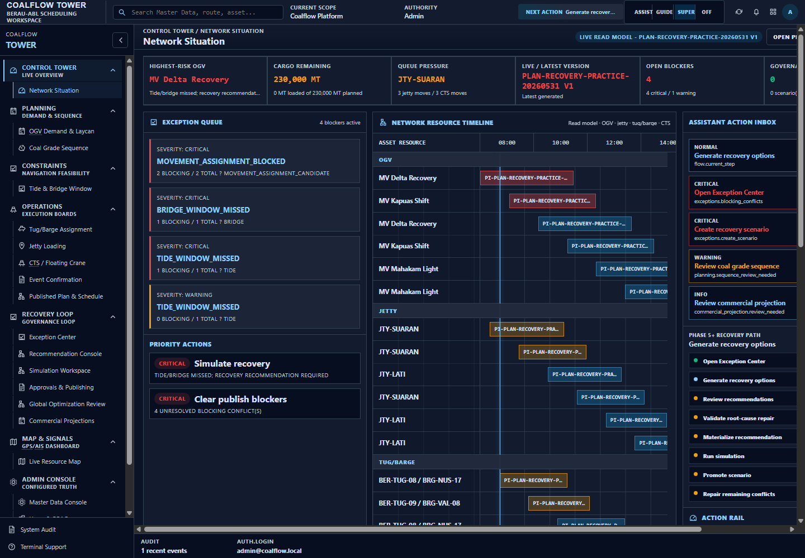

Output: the operator starts with a generated but blocked recovery practice plan. No recommendations or scenarios exist yet. The expected Next Action is `GENERATE_RECOVERY_OPTIONS`.

Reason: this proves the recovery drill is not starting from a clean plan. The plan has real blockers and must go through recovery before approval or publication.

### 2. Open Exception Center From Next Action

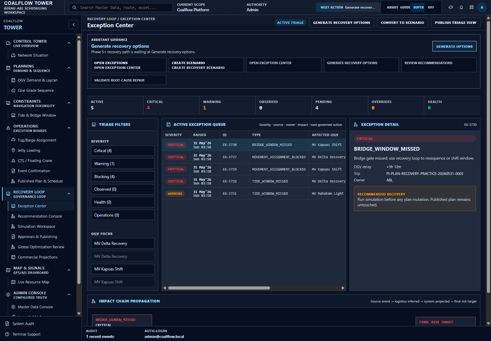

Output: the Exception Center shows the blocking queue while the flow remains on `generate_recovery_options`.

Reason: the operator must start from triage. The system should not jump to approval while unresolved blocking conflicts exist.

### 3. Generate Recovery Options

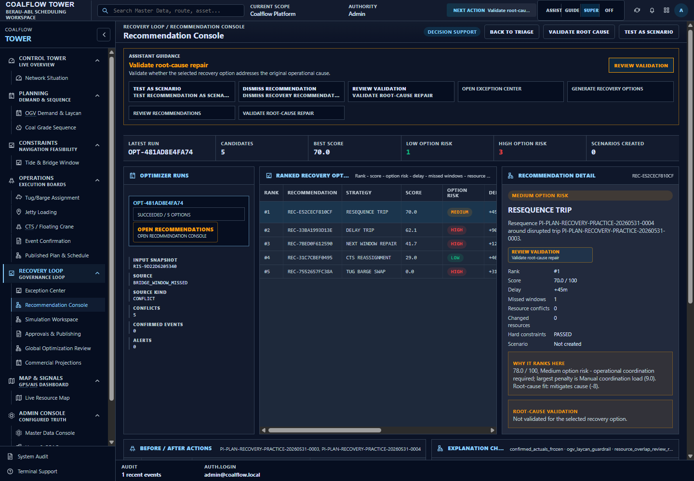

Output: one recovery snapshot, one optimizer run, and five recovery recommendations are created by the visible CTA. The flow moves to `validate_root_cause`.

Reason: recommendations are advisory until validated and tested. The run deliberately does not count management-command setup as recommendation creation.

### 4. Validate Root-Cause Repair

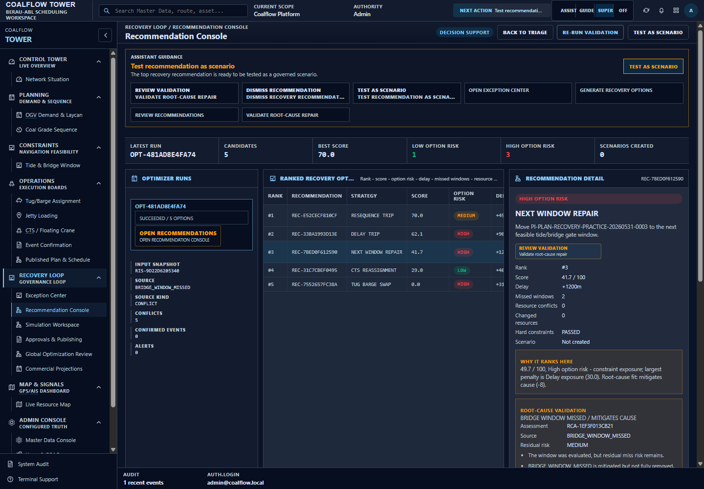

Output: the selected recovery recommendation records root-cause status `mitigates_cause`.

Reason: the selected recommendation does not fully remove the original window miss, but it provides an operational mitigation. That is allowed to proceed as a publishability warning later. A `does_not_address_cause` or `unknown` result remains blocked.

### 5. Materialize As Scenario

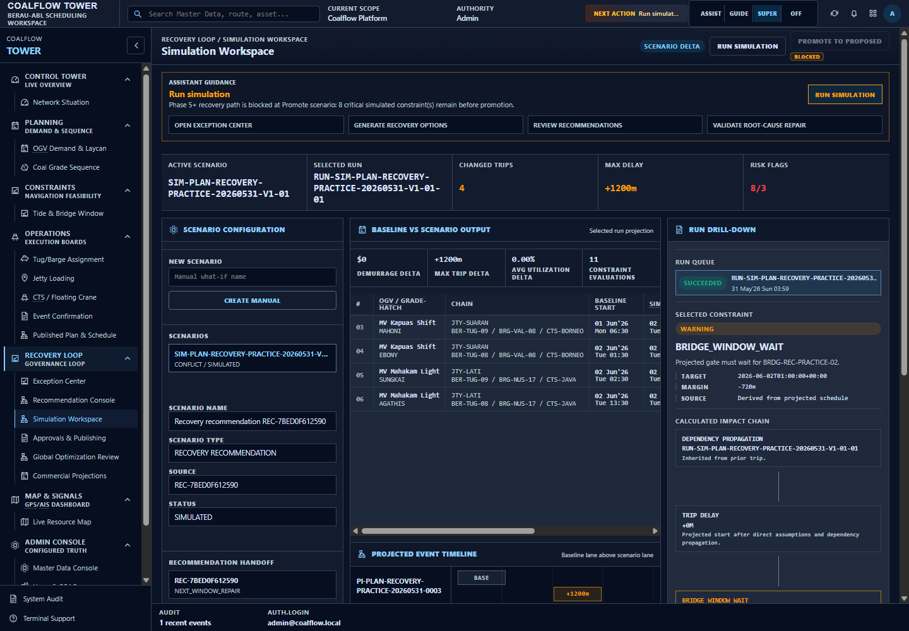

Output: one scenario and one scenario run exist. Promotion remains blocked because the first simulation still has critical simulated constraints.

Reason: materializing a recommendation is not the same as resolving the plan. The system correctly stops before promotion until the simulated candidate clears blockers.

### 6. Repair Recovery Operating Constraints

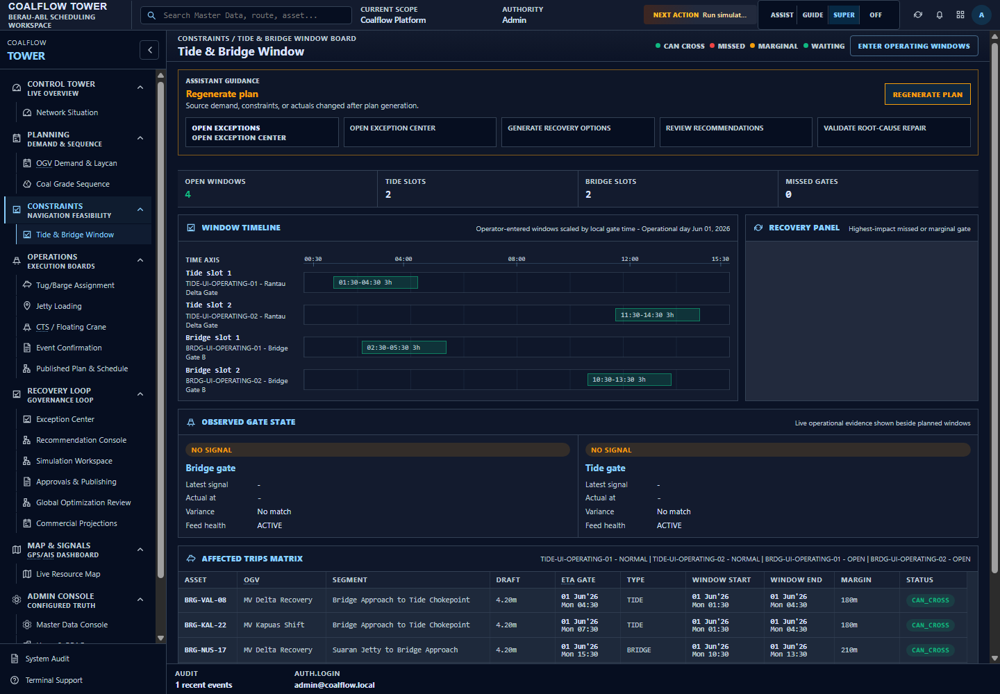

Output: the operator applies corrected recovery operating windows and availability context through the visible `ENTER OPERATING WINDOWS` CTA.

Reason: the selected scenario path still needed feasible tide and bridge context. This step changes the operating constraints, so the scenario must be simulated again before promotion.

### 7. Rerun Simulation

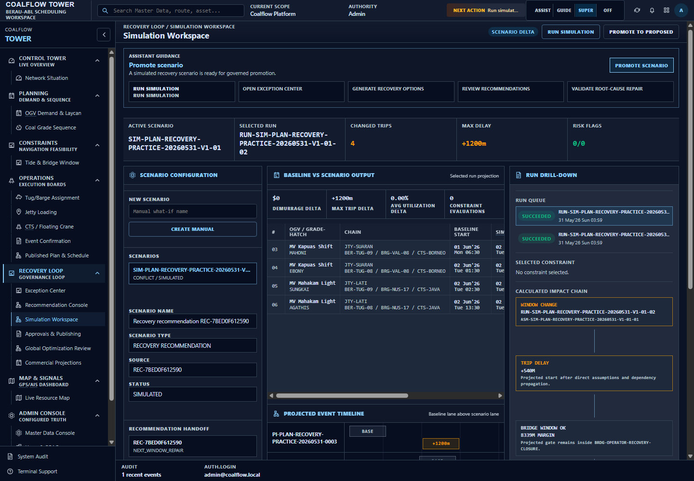

Output: scenario run count increases to two. The repaired run clears the critical simulated blockers and makes promotion possible.

Reason: this is the proof point that recovery is controlled by scenario evidence, not by blindly accepting the recommendation.

### 8. Promote The Repaired Scenario

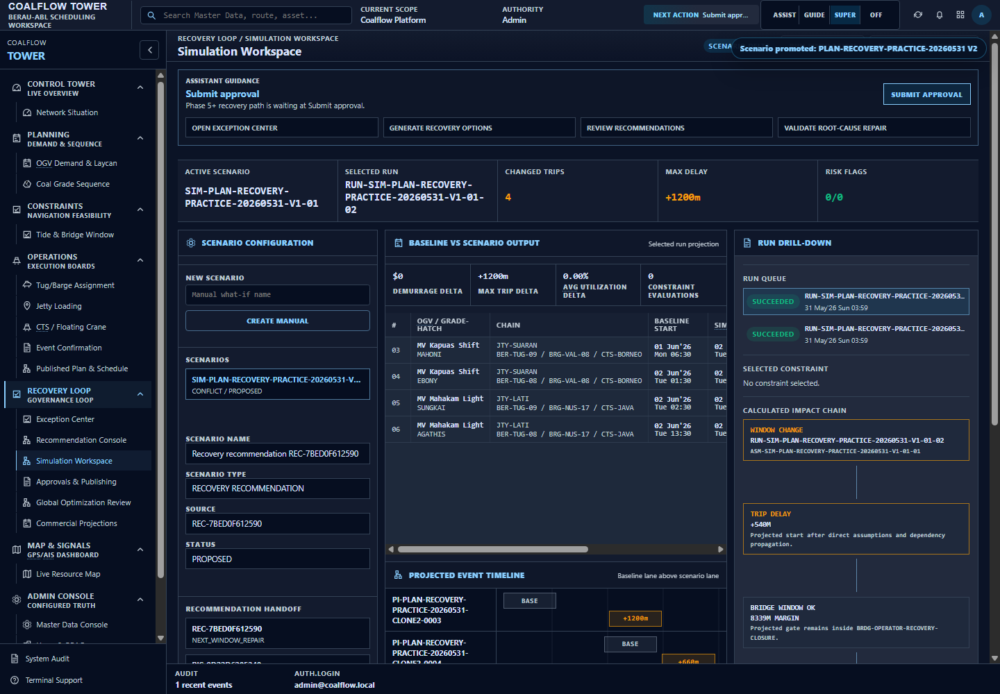

Output: the promoted plan becomes `PLAN-RECOVERY-PRACTICE-20260531 V2`, status `proposed`, validation `feasible`. Open conflicts are 0 and blocking conflicts are 0.

Reason: approval is only reachable after the recovered scenario has become a feasible proposed plan. This closes the original blockers for the publish candidate.

### 9. Review Candidate For Approval Submission

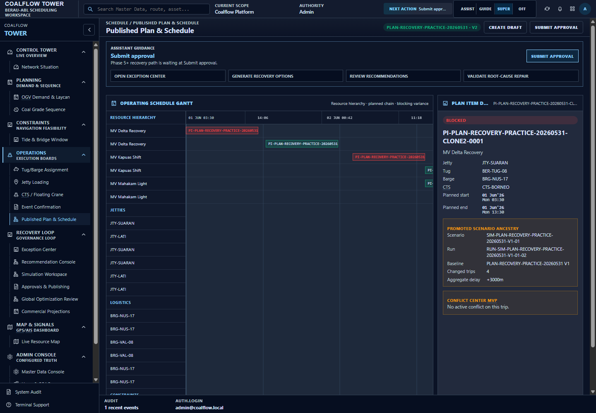

Output: Next Action routes the operator to the published-plan review surface with `SUBMIT_APPROVAL` still expected.

Reason: this is the governance handoff review. It is navigation, not a mutation.

### 10. Submit Approval

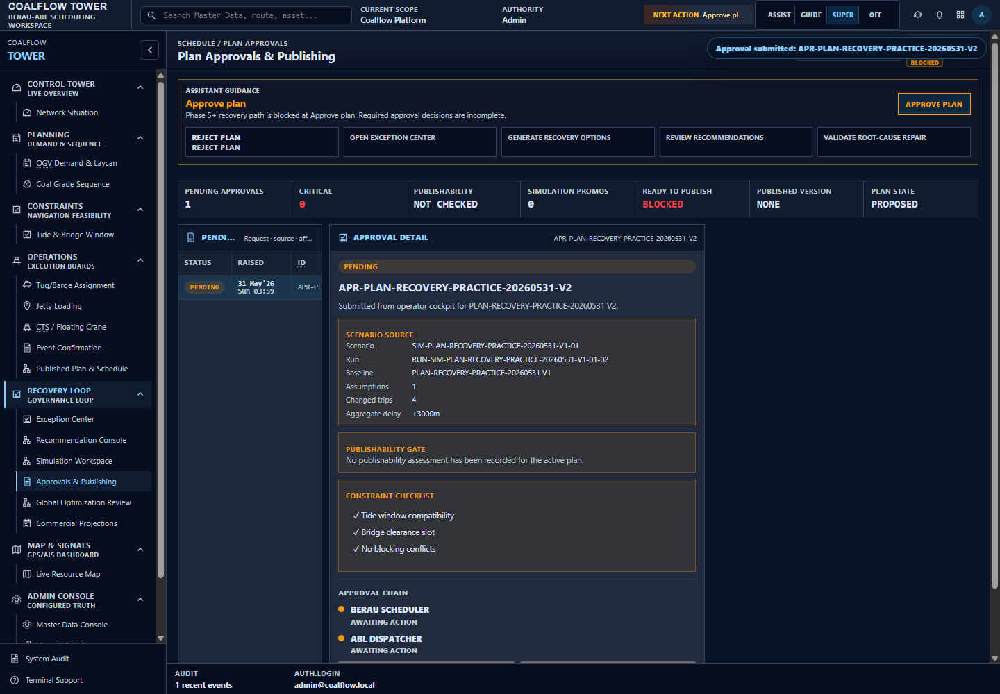

Output: one approval request is created for V2. The flow moves to `approve_plan` and remains blocked until required approvals are complete.

Reason: recovery does not replace Berau/ABL approval. Approval is still mandatory.

### 11. Record First Approval

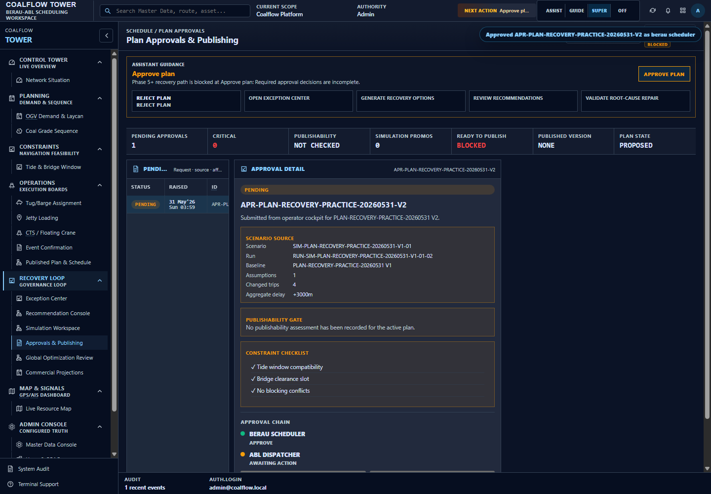

Output: the first approval decision is recorded. The approval step remains blocked.

Reason: one approval is insufficient. The flow must wait for all required authorities.

### 12. Complete Dual Approval

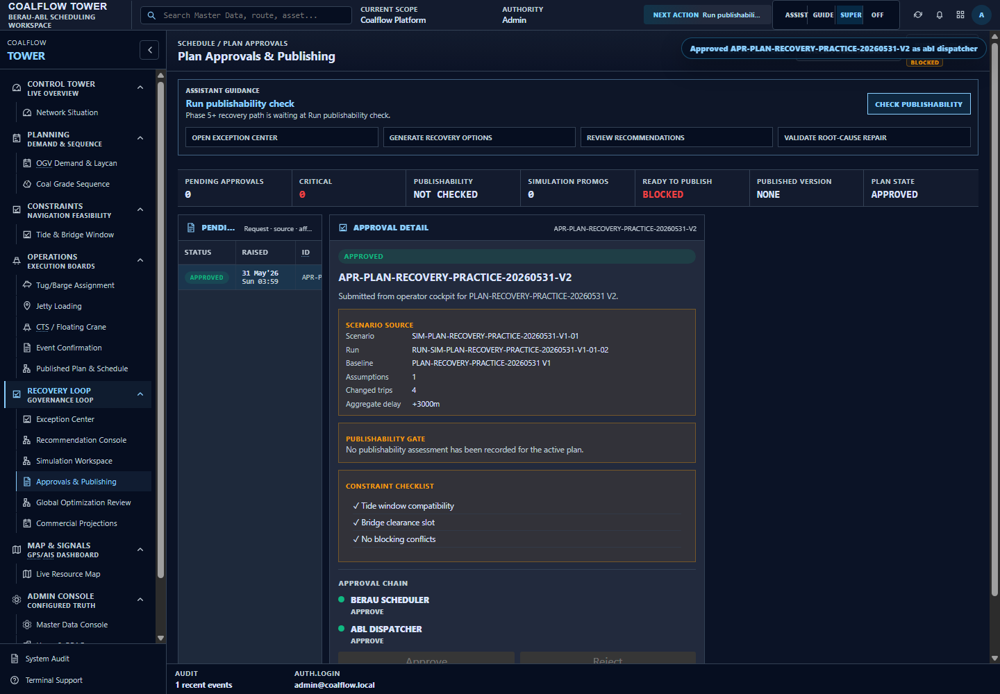

Output: required approvals are complete and V2 becomes `approved/feasible`. The flow moves to `run_publishability_check`.

Reason: approval completion is necessary but not sufficient. The publishability gate still has to validate operational and recovery-origin risk.

### 13. Run Publishability Gate

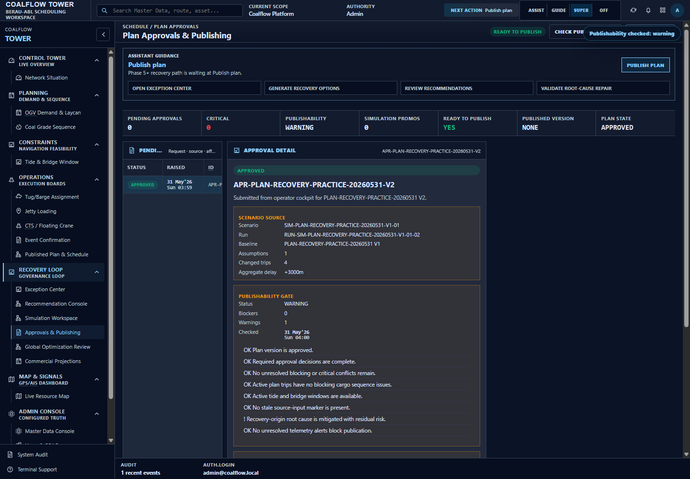

Output: publishability returns `warning`, with 0 blockers and 1 warning. The recommendation-origin detail is present and says the root cause is mitigated with residual risk.

Reason: `mitigates_cause` allows manual publish as a warning. The warning is deliberate because the root cause was mitigated rather than fully removed. Automatic publishing remains out of scope.

### 14. Manually Publish Recovery Plan

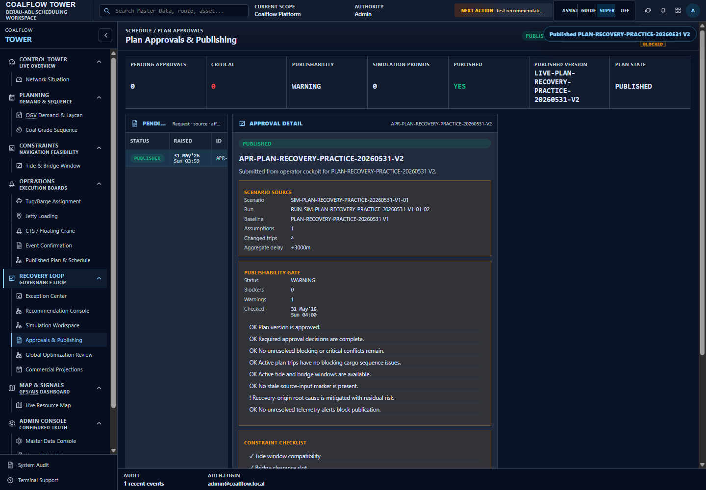

Output: the flow completes. Active plan version is `PLAN-RECOVERY-PRACTICE-20260531 V2`, status `published`, validation `feasible`. Open conflicts are 0, blocking conflicts are 0, approvals are complete, and one active published snapshot exists with recovery provenance.

Reason: this is the final governed state. The blocked V1 baseline is superseded, the recovered V2 plan is published, and the published snapshot carries recovery lineage.

## Final Runtime Assertions

| Assertion | Result |
|---|---|
| Flow completed | true |
| Recommendations created by UI CTA | true |
| Root-cause assessment exists | true |
| Scenario materialized by UI CTA | true |
| Publishability assessment exists | true |
| Approvals complete | true |
| Active published snapshot exists | true |
| Latest root-cause status allows publish | true |
| Publishability includes recommendation-origin detail | true |
| Published snapshot carries recovery provenance | true |
| Final open conflicts | 0 |
| Final blocking conflicts | 0 |
| Final active plan | `PLAN-RECOVERY-PRACTICE-20260531 V2` |
| Final plan status | `published` |
| Final validation status | `feasible` |

## Negative Gate Evidence

The evidence run also includes a negative guardrail path. It creates an otherwise approved recovery-origin plan whose selected recommendation has root-cause status `does_not_address_cause`.

| Negative gate output | Runtime value |
|---|---|
| Root-cause status | `does_not_address_cause` |
| Publishability status | `blocked` |
| Publish attempt status | `400` |
| Backend refusal | `Publish is blocked by publishability gate: Recovery-origin root cause remains unresolved or unknown.` |

Reason: this proves the publish path is not only a UI convention. The backend publish service refuses publication when recovery-origin root-cause validation fails, even if approval and ordinary conflicts are clear.

## Operator Interpretation

The recovery path is successful only when all of these are true:

- the selected recommendation has root-cause status `addresses_cause` or `mitigates_cause`;
- a scenario exists and its repaired simulation has no critical blockers;
- the promoted recovery plan has 0 open blocking conflicts;
- both required approval authorities have approved;
- publishability has 0 blockers;
- manual publish creates an active published snapshot with recovery provenance.

The latest evidence run meets those conditions.
