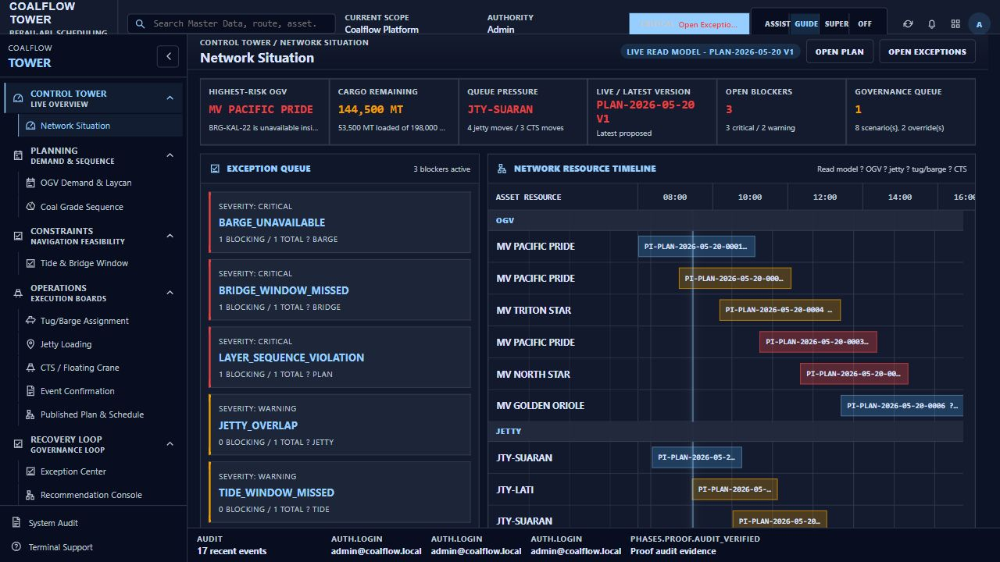
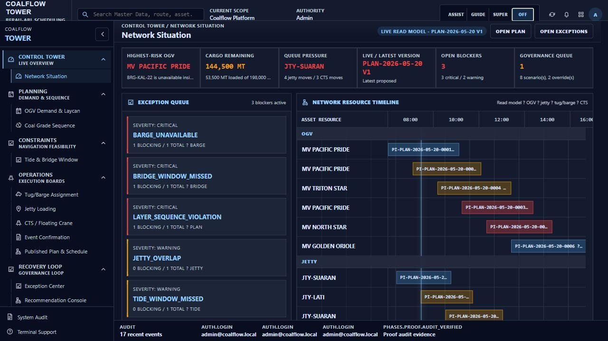
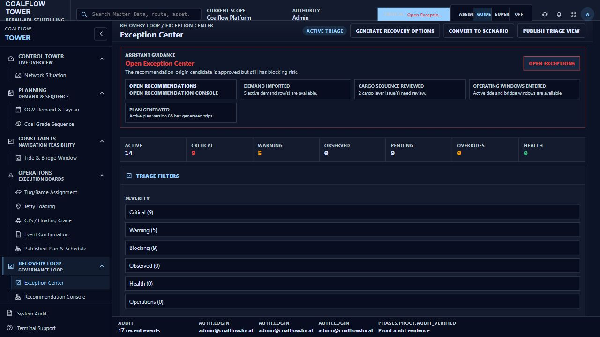
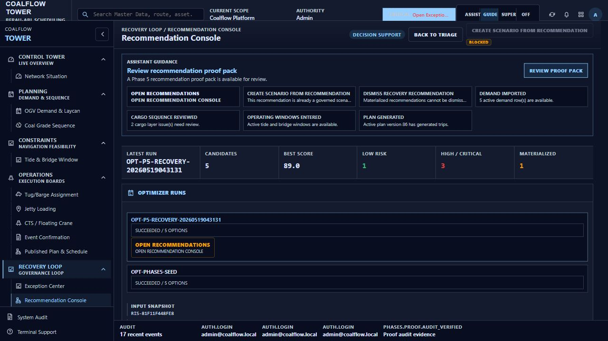
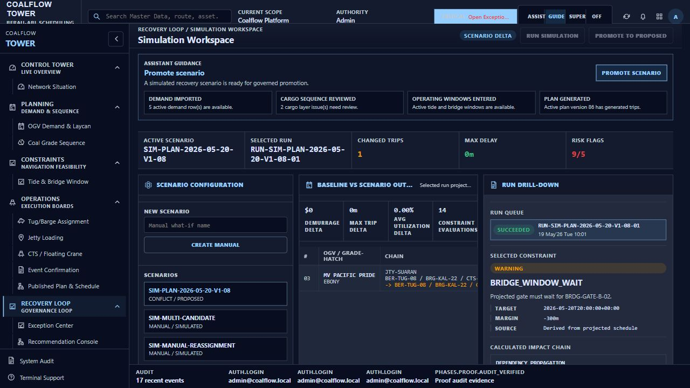
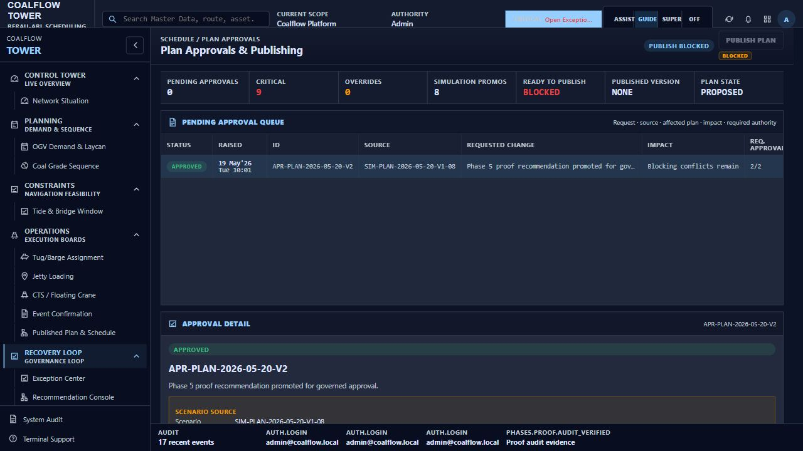
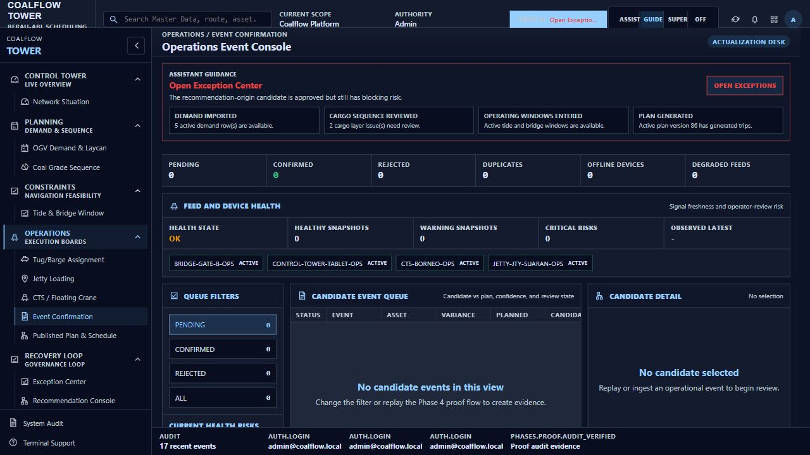
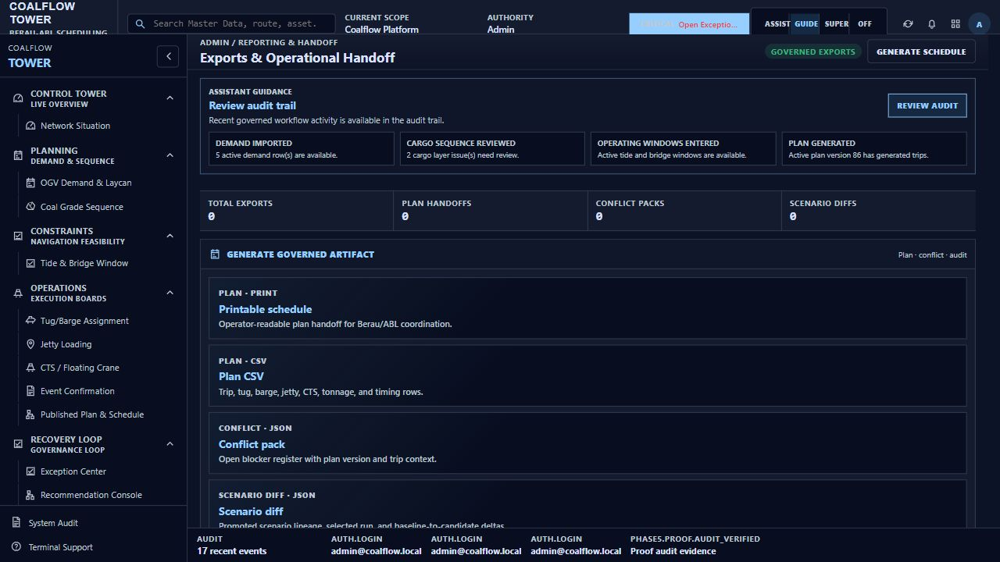
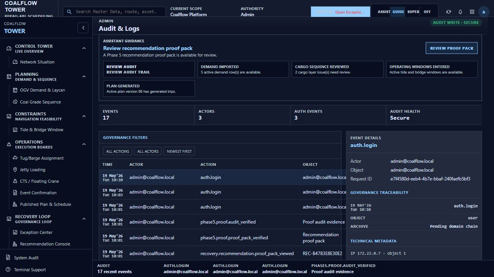

# Next Action Assist - Current-State Operator Evidence

Captured on 2026-05-19 against the local app at `http://localhost:8080`.

Raw evidence:

- `assist_screen_capture.json`
- `assist_click_evidence.json`
- `screenshots/`

No business-state-changing CTA was clicked during this pass. Navigation and mode CTAs were clicked. Mutating CTAs were inspected for enabled or blocked state only.

## Current State Summary

The assistant is in `Guide` mode.

The global topbar action is:

```text
Open Exception Center
Reason: The recommendation-origin candidate is approved but still has blocking risk.
```

This same top action appears on every screen because the highest ranked rule is a publish blocker. In simple terms: the system has an approved recovery candidate, but blocking risk remains, so the assistant keeps pulling the operator back to Exception Center before publish/export.

The current UI is noisy for three reasons:

1. The global assistant action repeats on every screen, even when a page also has local guidance.
2. Dashboard numbers and deeper workflow screens are not visually reconciled in one place. Dashboard shows the operator a high-level blocker summary, while Exception Center and Approvals show the deeper proof-run blocker state.
3. Some page-level domain buttons look similar to assistant buttons. The assistant mostly navigates. The page buttons may mutate state, generate proof, create scenarios, publish, or export.

## Simple Operator Flow

1. Start on Dashboard.
2. Read the topbar assistant pill. It says `Open Exception Center`.
3. Click `Open Exception Center`.
4. Review active blockers in Exception Center.
5. If the operator wants to inspect the Phase 5 recommendation, click `Open recommendations`.
6. On Recommendation Console, note that the selected top recommendation is already materialized. `Create scenario from recommendation` is blocked.
7. Click `Open simulation workspace` to inspect the materialized scenario.
8. On Simulation Workspace, note that `Run simulation`, `Promote to proposed`, and `Add assumption` are blocked because the selected scenario is already proposed/materialized.
9. Go to Approvals. Publish is blocked because the plan still has critical/blocking risk.
10. Return to Exception Center to clear blockers before trying publish/export.
11. Use Audit Logs to verify the recovery proof trail.

## CTA Status

### CTAs That Navigated Correctly

| Screen | CTA clicked | Result |
|---|---|---|
| Dashboard | Topbar `Open Exception Center` | Navigated to `#/exceptions/center` |
| Dashboard | Inbox `Open Recommendation Console` | Navigated to `#/recovery/recommendations` |
| Dashboard | Inbox `Promote scenario` | Navigated to `#/simulation/workspace` |
| Dashboard | Inbox `Review audit trail` | Navigated to `#/admin/audit-logs` |
| Exception Center | `Open recommendations` | Navigated to `#/recovery/recommendations` |
| Recommendation Console | `Open simulation workspace` | Navigated to `#/simulation/workspace` |
| Event Console | `Open exceptions` | Navigated to `#/exceptions/center` |
| Export Handoff | `Review audit` | Navigated to `#/admin/audit-logs` |
| Audit Logs | `Review proof pack` | Navigated to `#/recovery/recommendations` |

### CTAs That Are Blocked In The Current State

| Screen | CTA | Why it does not work now |
|---|---|---|
| Recommendation Console | `Create scenario from recommendation` | The selected recommendation is already materialized as a governed scenario. |
| Simulation Workspace | `Run simulation` | The selected scenario already has a run/proposed state. |
| Simulation Workspace | `Promote to proposed` | The selected scenario is already proposed. |
| Simulation Workspace | `Add assumption` | The selected scenario is not in an editable assumption state. |
| Approvals | `Publish plan` | Publish is blocked by unresolved critical/blocking risk. |
| Approvals | `Approve` | The request is already approved. |
| Approvals | `Reject` | The request is already approved. |
| Approvals | Detail `Publish` | Publish is blocked by unresolved critical/blocking risk. |

### CTAs Available But Not Clicked

These buttons appear enabled, but they can write state or generate artifacts. They were not clicked during evidence capture.

| Screen | CTA | Why not clicked |
|---|---|---|
| Exception Center | `Generate recovery options` | Would create/run recovery option evidence. |
| Exception Center | `Convert to scenario` | Would create a scenario from selected exception context. |
| Exception Center | `Publish triage view` | Would generate/report triage output. |
| Simulation Workspace | `Submit approval request` | Would submit approval governance. |
| Export Handoff | `Generate schedule` | Would generate an export artifact. |

## Screen Evidence

### 1. Dashboard / Network Situation



What the operator sees:

- Topbar assistant: `Open Exception Center`.
- Dashboard action inbox has six active assistant actions:
  - `Open Exception Center`
  - `Open Recommendation Console`
  - `Review coal grade sequence`
  - `Promote scenario`
  - `Review recommendation proof pack`
  - `Review audit trail`
- Guided checklist is visible because mode is `Guide`.

What to click:

1. Click the topbar `Open Exception Center` if following the highest priority action.
2. Click `Open Recommendation Console` only if inspecting the Phase 5 recommendation.
3. Click `Review audit trail` only if checking evidence.

What is confusing:

- Several active actions are shown at once. Only the top action is the main next step.
- The operator should treat the inbox as a queue, not as equal-priority buttons.

### 2. Dashboard With Assist Off



What the operator sees:

- The topbar mode toggle remains.
- The global pill, action inbox, page cards, and guided checklist are hidden.

What works:

- `Off` hides assistive surfaces.
- `Guide` brings the global action, inbox, and checklist back.

### 3. Exception Center



What the operator sees:

- Assistant guidance still says `Open Exception Center`.
- The page is already Exception Center, so this CTA is effectively a same-screen reminder.
- Secondary assistant CTA `Open recommendations` is available.
- Header buttons `Generate recovery options`, `Convert to scenario`, and `Publish triage view` are available but were not executed.

What to click:

1. Review the exception table.
2. If using the existing Phase 5 recommendation, click `Open recommendations`.
3. Do not click generate/convert buttons unless the operator intends to create new recovery work.

### 4. Recommendation Console



What the operator sees:

- Assistant guidance says `Review recommendation proof pack`.
- The selected recommendation has status `MATERIALIZED`.
- `Create scenario from recommendation` is blocked.
- Row hints show proof-pack review.

What works:

1. `Review proof pack` stays on the recommendation evidence view.
2. `Open simulation workspace` navigates to the scenario created from the recommendation.

What does not work:

- `Create scenario from recommendation` is blocked because this recommendation already has scenario handoff.

### 5. Simulation Workspace



What the operator sees:

- Assistant guidance says `Promote scenario`.
- The active scenario is `SIM-PLAN-2026-05-20-V1-08`.
- The scenario status is already `PROPOSED`.

What works:

- Assistant `Promote scenario` navigates to the same screen because the action route is Simulation Workspace.
- `Open recommendation` navigates back to the source recommendation.

What does not work:

- `Run simulation` is disabled.
- `Promote to proposed` is disabled.
- `Add assumption` is disabled.

What was not clicked:

- `Submit approval request` appears available, but it is a state-changing approval action.

### 6. Approvals And Publishing



What the operator sees:

- Approval request is already `APPROVED`.
- `Ready to publish` is `BLOCKED`.
- Constraint checklist still shows blocker items.
- Publish controls are blocked.

What does not work:

- `Publish plan` is disabled.
- `Approve` is disabled.
- `Reject` is disabled.
- Detail `Publish` is disabled.

Operator meaning:

- The approval chain is complete, but publish cannot happen until blockers are resolved.
- The correct next move is back to Exception Center, not export.

### 7. Operations Event Console



What the operator sees:

- No pending event candidates.
- No confirmed events.
- Assistant guidance points back to `Open Exception Center`.

What works:

- `Open exceptions` navigates to Exception Center.

Operator meaning:

- There is no event-confirmation work in the current state. The assistant is not asking the operator to confirm or reject events.

### 8. Export Handoff



What the operator sees:

- Assistant guidance says `Review audit trail`, not `Generate export`.
- No governed exports exist in the current view.
- `Generate schedule` appears enabled, but it was not clicked because it would create an artifact.

What works:

- `Review audit` navigates to Audit Logs.

What is confusing:

- The page-level `Generate schedule` button is visible even though the assistant is not recommending export. In current governance terms, the assistant is safer: it is telling the operator to resolve blockers and review audit evidence first.

### 9. Audit Logs



What the operator sees:

- Assistant guidance says `Review recommendation proof pack`.
- Recent proof and recovery audit entries are visible.

What works:

- `Review proof pack` navigates back to Recommendation Console.
- `Review audit` stays on the audit evidence surface.

Operator meaning:

- This is a verification screen. It is not the place to resolve blockers.

## Bottom Line

The assistant can navigate the operator through the current state, but the current visual presentation is not clean enough.

The real workflow is:

```text
Dashboard
to Exception Center
to Recommendation Console
to Simulation Workspace
to Approvals
back to Exception Center until blockers are cleared
then Audit/Export after governance is safe
```

The current state blocks publish/export. The strongest assistant recommendation is correct: go to Exception Center and resolve risk before trying to publish.
