# Assist SUPER Mode Recovery Practice Guide

Date: 2026-05-19  
Workspace: `F:\ocean`  
Mode tested: `SUPER`  
User tested: `admin@coalflow.local`

## What This Guide Shows

This guide explains how an operator can use Assist in `SUPER` mode to recover a blocked plan and finish with a published, feasible `V2` plan.

The practice flow starts with:

| Area | Starting screen result |
|---|---:|
| OGV demands | 3 |
| Cargo layers | 6 |
| Missed tide or bridge checks | 2 |
| Open blockers | 4 critical / 2 warning |
| Active plan | `PLAN-RECOVERY-PRACTICE-20260519 V1` |
| Plan state | `generated / blocked` |

The practice flow ends with:

| Area | Ending screen result |
|---|---:|
| Active plan | `PLAN-RECOVERY-PRACTICE-20260519 V2` |
| Plan state | `published / feasible` |
| Open blockers | 0 |
| Missed tide or bridge checks | 0 |
| Approvals | 2 of 2 complete |
| Export | Printable schedule generated |

## How To Read Assist

Use only what is visible on the screen:

| UI area | What it means |
|---|---|
| Top blue Assist banner | The fastest button to the next screen Assist wants the operator to open. |
| `Assistant Action Inbox` | The full list of Assist cards. The first card is usually the most urgent. |
| Page button | The button inside the working page, such as `Generate recovery options`, `Run simulation`, or `Submit approval`. |
| `Lifecycle Checklist` | A progress list showing which major planning steps are done or still pending. |

This guide uses the same words shown in the app. Follow the visible button text and page names below.

## Start Afresh

Use this section when the operator wants to practice from a clean training system, not from whatever data is currently on screen.

### A. Reset To Masters Only

Do this:

1. Run this command:

```powershell
docker compose exec -T api python manage.py seed_phase0 --master-data-only
```

2. Open the app.
3. Sign in as `admin@coalflow.local`.
4. Go to `Network Situation`.
5. Switch Assist to `SUPER`.

Why:

This removes transactional records and keeps only setup data such as users, roles, permissions, locations, routes, coal grades, jetties, tugs, barges, and CTS assets.

You should see:

- No active recovery plan.
- No active OGV demand created for this practice run.
- No active blockers for this practice run.
- No approvals or exports from this practice run.

### B. Build The Recovery Practice Case

Do this:

1. Keep the app open.
2. Run this command:

```powershell
docker compose exec -T api python manage.py seed_assistant_recovery_practice --skip-reset
```

3. Refresh the app.
4. Stay in `SUPER` mode.
5. Go to `Network Situation`.

Why:

This creates the practice transaction data on top of the clean masters-only system. It builds the training case the operator will recover:

- multiple OGV demand rows,
- cargo layers for those OGVs,
- tide and bridge checks,
- `PLAN-RECOVERY-PRACTICE-20260519 V1`,
- open blockers caused by missed tide or bridge windows.

You should see:

- `Open Blockers` showing critical blockers.
- `Assistant Action Inbox` showing `Open Exception Center`.
- The top blue Assist banner showing `Open Exception Center`.
- The active plan showing `PLAN-RECOVERY-PRACTICE-20260519 V1`.
- The plan still blocked, not published.

### C. Operator Practice Goal

The operator should now use the click-by-click flow below to:

1. inspect multiple OGV demand,
2. inspect missed tide and bridge checks,
3. open `Exception Center`,
4. generate recovery options,
5. create and run a simulation scenario,
6. promote the scenario,
7. return to unresolved blockers,
8. enter corrected operating windows,
9. regenerate the plan into feasible `V2`,
10. submit approvals,
11. publish `V2`,
12. generate the printable schedule handoff.

The practice is complete only when the operator can see:

- plan state `published / feasible`,
- active plan `PLAN-RECOVERY-PRACTICE-20260519 V2`,
- open blockers `0`,
- missed tide or bridge checks `0`,
- printable schedule generated.

## Click-By-Click Operator Flow

### 1. Start On Network Situation

Screen: `Network Situation`

Do this:

1. Stay on `Network Situation`.
2. Confirm Assist is in `SUPER` mode.
3. Look at the top blue Assist banner and the first card in `Assistant Action Inbox`.
4. Confirm both point the operator to `Open Exception Center`.

Why:

The screen is telling the operator that the plan has blockers and the right starting point is exception triage.

You should see:

- `Open Blockers` showing `4`.
- `Assistant Action Inbox` showing `Open Exception Center`.
- The active plan marked as a recovery practice plan.

Works: yes. The visible `Open Exception Center` button opens the exception screen.

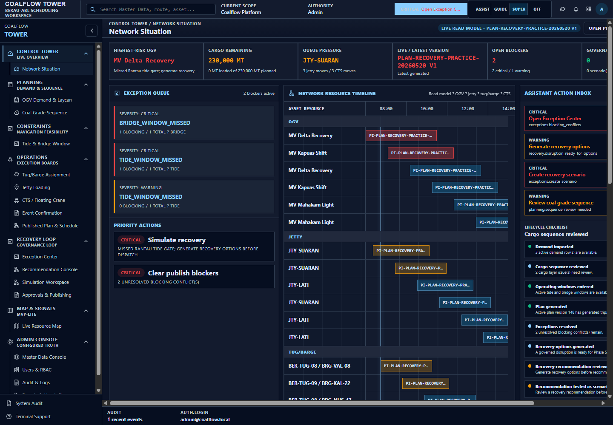

### 2. Check Multiple OGV Demand

Screen: `OGV Demand & Laycan`

Do this:

1. Click `OGV Demand & Laycan` in the left navigation.
2. Confirm the training case has multiple OGV rows.
3. Confirm the cargo demand rows are already present.

Why:

The operator needs to know this is not a single-vessel case. The recovery has to protect several OGV demands at the same time.

You should see:

- 3 OGV demands.
- 6 cargo layers.
- Assist still showing that blockers need attention.

Works: yes. The navigation opens the demand board.

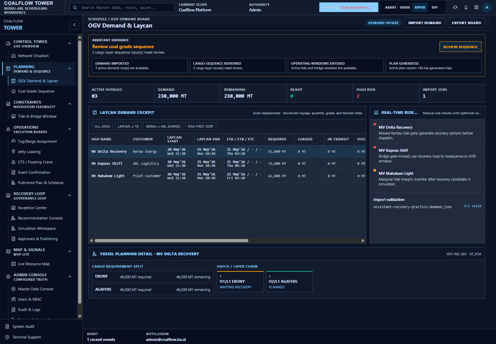

### 3. Check Tide And Bridge Misses

Screen: `Tide & Bridge Window`

Do this:

1. Click `Tide & Bridge Window`.
2. Look for the missed gate information.
3. Confirm the page shows missed tide or bridge checks.

Why:

The operator must understand why the plan is blocked before choosing a recovery path.

You should see:

- Missed gate information.
- Tide and bridge checks tied to the current plan.
- Assist still directing the operator toward exception handling.

Works: yes. The navigation opens the tide and bridge screen.

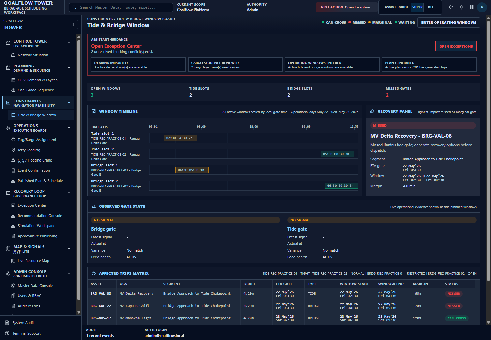

### 4. Open Exception Center

Screen: `Exception Center`

Do this:

1. Click `Open Exception Center` from the top blue Assist banner or the `Assistant Action Inbox` card.
2. On `Exception Center`, select the first critical blocker if it is not already selected.
3. Read the selected blocker details.

Why:

This is where the operator sees the active blockers and starts recovery work.

You should see:

- A critical blocker selected.
- A visible `Generate recovery options` button.
- The blocker details explaining what is preventing the plan from moving forward.

Works: yes. The Assist button opens `Exception Center`.

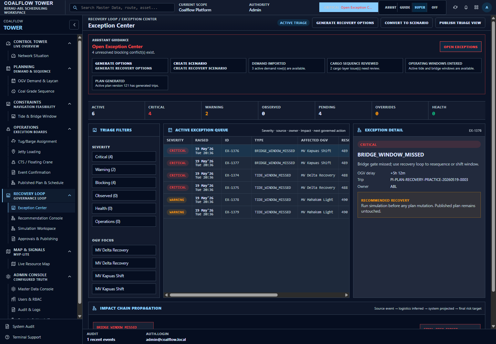

### 5. Generate Recovery Options

Screen: `Recommendation Console`

Do this:

1. Click `Generate recovery options`.
2. Wait for `Recommendation Console` to open.
3. Review the ranked options.
4. Keep the top ranked option selected.

Why:

The operator is asking the app to prepare recovery choices, compare them, and show the safest option first.

You should see:

- `Ranked recovery options`.
- Scores, risk, delay, missed windows, and resource conflict columns.
- A button named `Create scenario from recommendation`.

Works: yes. `Generate recovery options` creates the recovery choices and opens the recommendation screen.

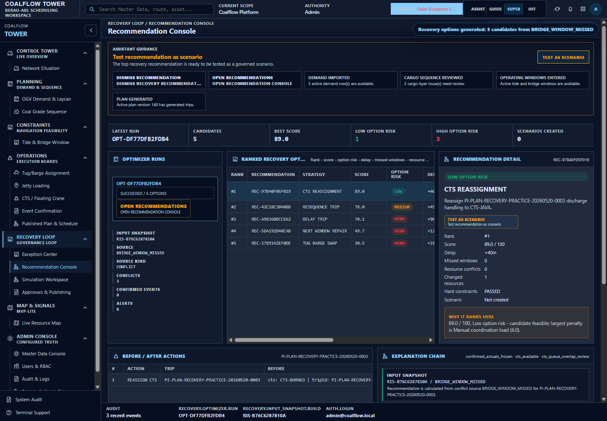

### 6. Create A Scenario From The Recommendation

Screen: `Simulation Workspace`

Do this:

1. Click `Create scenario from recommendation`.
2. Wait for `Simulation Workspace` to open.
3. Confirm the selected recommendation is now available as a scenario.

Why:

The operator should test the chosen recovery option before trying to make it the working plan.

You should see:

- `Simulation Workspace`.
- A selected scenario.
- A visible `Run simulation` button.
- A visible `Promote to proposed` button.

Works: yes. `Create scenario from recommendation` opens the simulation workspace.

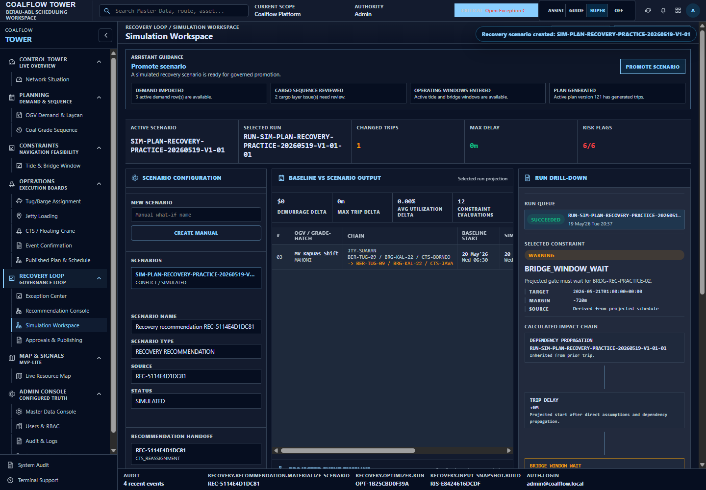

### 7. Run The Simulation

Screen: `Simulation Workspace`

Do this:

1. Click `Run simulation`.
2. Wait until the page shows the simulation has completed.
3. Review the baseline and scenario output.

Why:

The operator needs to see whether the recovery option improves the plan before promoting it.

You should see:

- Simulation output.
- Baseline versus scenario timing.
- Resource changes and risk flags.

Works: yes. `Run simulation` completes the scenario run.

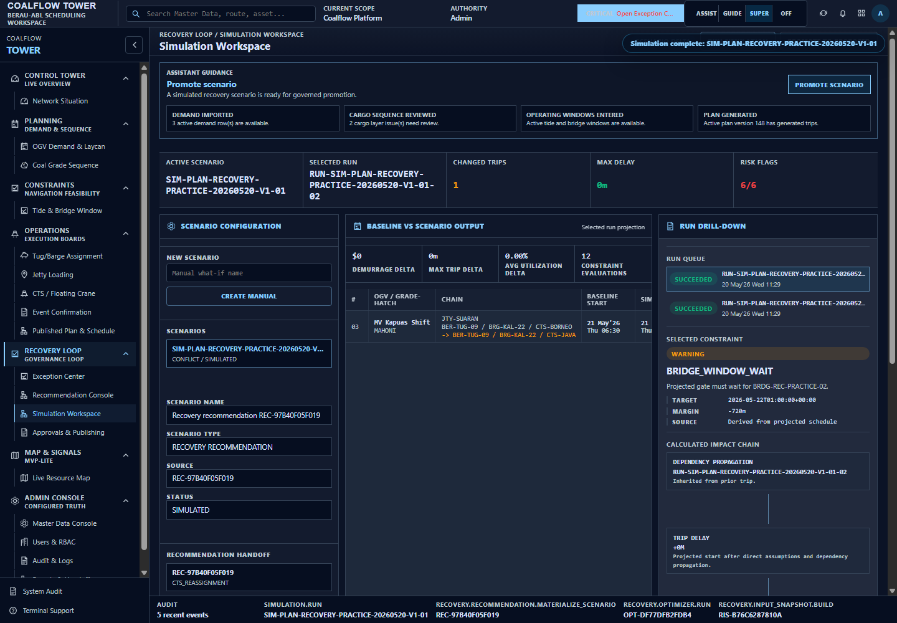

### 8. Promote The Scenario

Screen: `Simulation Workspace`

Do this:

1. Click `Promote to proposed`.
2. Wait for the screen to confirm the scenario was promoted.
3. Read the remaining blocker status.

Why:

This step teaches that a promoted scenario is not automatically ready to publish. If hard blockers remain, the operator must continue the recovery loop.

You should see:

- The scenario promoted.
- Remaining blockers still present.
- Assist sending the operator back to `Open Exception Center`.

Works: yes. The button works, and the remaining block is expected in this training case.

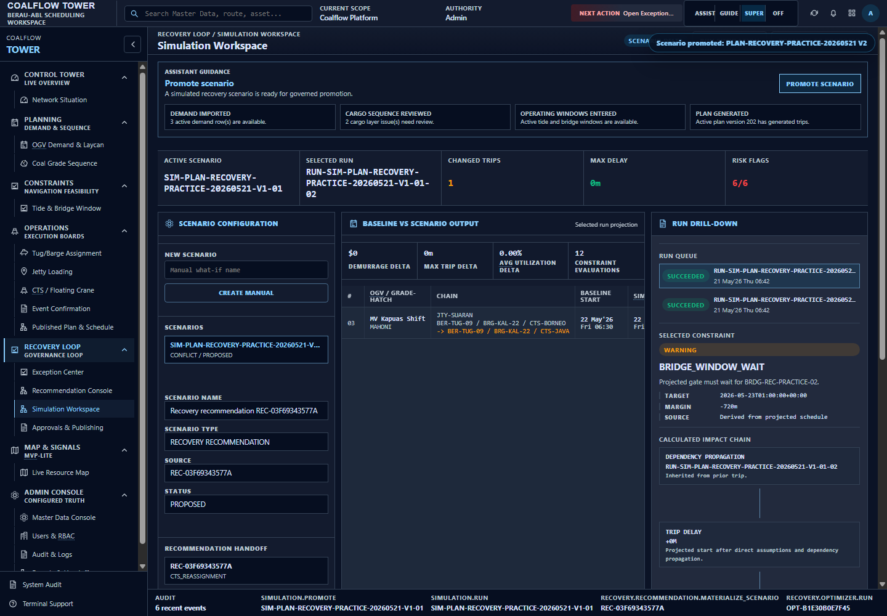

### 9. Return To The Open Blockers

Screen: `Exception Center`

Do this:

1. Click `Open Exception Center`.
2. Confirm the page still shows unresolved tide or bridge blockers.
3. Do not stop here. Continue to the constraint screen next.

Why:

The operator is being shown that the first recovery attempt still needs corrected operating windows.

You should see:

- Open critical blockers.
- The plan still not ready for approval.
- A clear reason to fix operating windows.

Works: yes. Assist returns the operator to the blocker list.

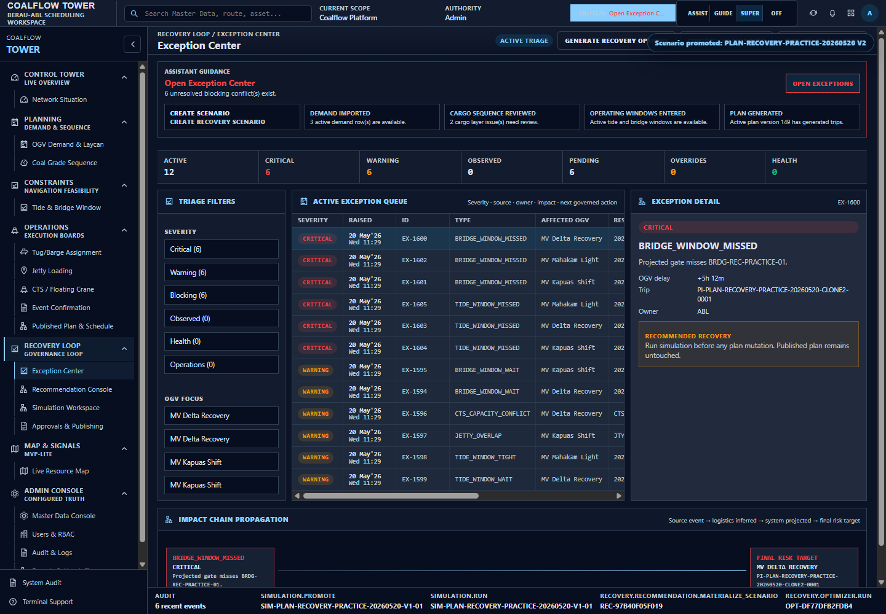

### 10. Enter Corrected Operating Windows

Screen: `Tide & Bridge Window`

Do this:

1. Click `Tide & Bridge Window`.
2. Click `Enter operating windows`.
3. Wait for the page to refresh.
4. Confirm missed windows are cleared.

Why:

The blocked recovery cannot finish until the tide and bridge timing issue is corrected.

You should see:

- Updated tide and bridge windows.
- Missed window count cleared.
- Assist now moving the operator toward plan regeneration.

Works: yes. `Enter operating windows` applies the corrected windows.

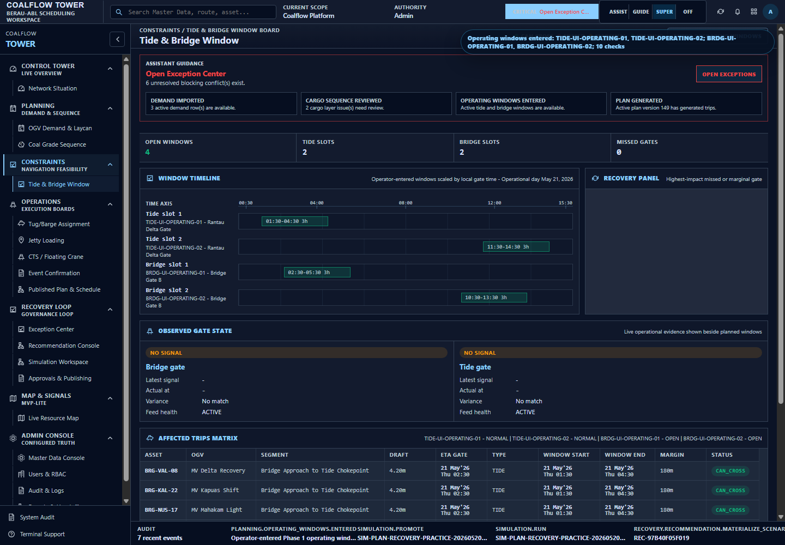

### 11. Regenerate The Plan

Screen: `Tug/Barge Assignment`

Do this:

1. Click `Tug/Barge Assignment`.
2. Click `Regenerate plan`.
3. Wait until the plan result changes to feasible.

Why:

After fixing the windows, the operator must rebuild the plan so the plan uses the corrected constraints.

You should see:

- `PLAN-RECOVERY-PRACTICE-20260519 V2`.
- Plan status showing feasible.
- Open blockers showing `0`.
- Assist moving the operator toward approval.

Works: yes. `Regenerate plan` creates the feasible `V2` recovery plan.

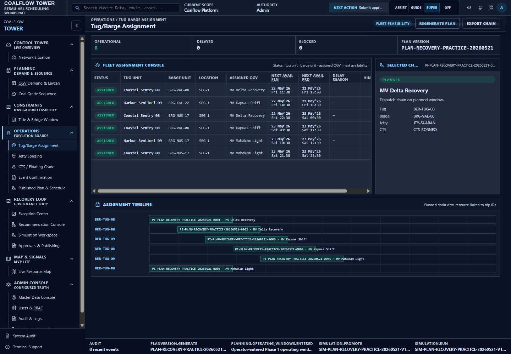

### 12. Review The Feasible Plan

Screen: `Published Plan & Schedule`

Do this:

1. Click `Published Plan & Schedule`.
2. Confirm `V2` is feasible.
3. Click `Submit approval`.

Why:

The operator should review the feasible recovery candidate before asking the required approvers to approve it.

You should see:

- The feasible `V2` plan.
- No open blockers.
- A visible `Submit approval` button.

Works: yes. `Submit approval` sends the plan to the approval screen.

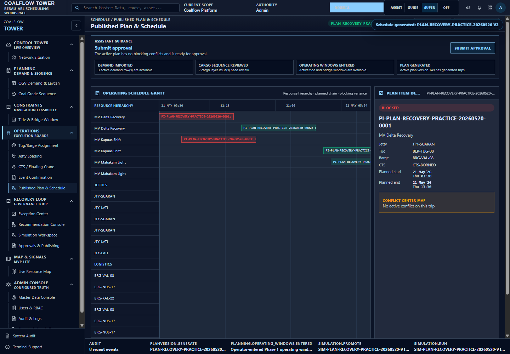

### 13. Submit Approval

Screen: `Plan Approvals & Publishing`

Do this:

1. Confirm the approval request is visible.
2. Confirm the request is waiting for approvals.
3. Click `Approve`.

Why:

The recovery plan needs the required approvals before it can become the live published plan.

You should see:

- One approval request.
- The first `Approve` button available.
- The plan not published yet.

Works: yes. The first `Approve` click records the first approval.

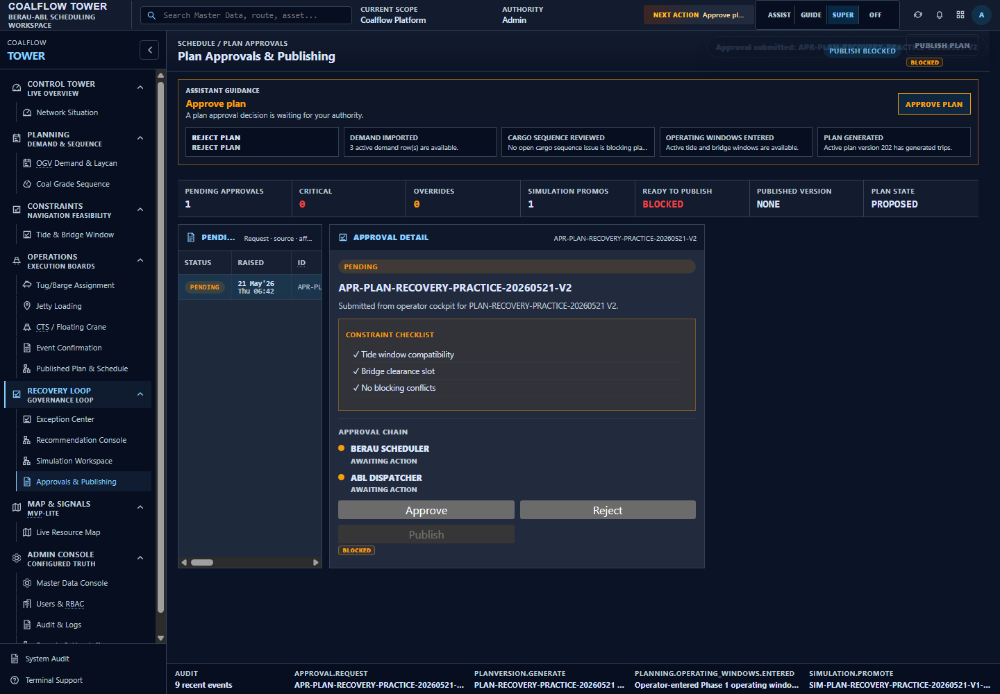

### 14. Record The First Approval

Screen: `Plan Approvals & Publishing`

Do this:

1. Confirm the first approval is recorded.
2. Click `Approve` again for the second required approval.

Why:

The plan still needs the second approval before publishing becomes valid.

You should see:

- One approval recorded.
- One approval still needed.
- The `Approve` button still available.

Works: yes. The second `Approve` click records the second approval.

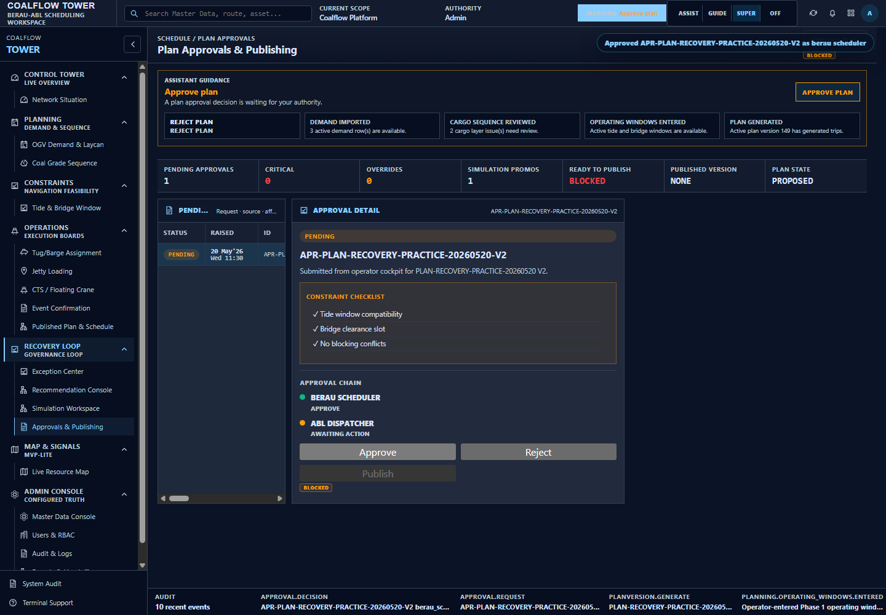

### 15. Confirm Both Approvals Are Complete

Screen: `Plan Approvals & Publishing`

Do this:

1. Confirm both approvals are complete.
2. Click `Publish plan`.

Why:

Publishing is the step that makes the approved recovery plan the active plan for operations.

You should see:

- Approval count complete.
- A visible `Publish plan` button.
- The plan still waiting to be published.

Works: yes. `Publish plan` publishes the approved `V2` plan.

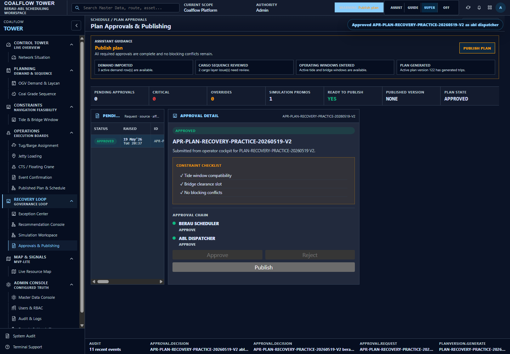

### 16. Confirm The Recovery Plan Is Published

Screen: `Plan Approvals & Publishing`

Do this:

1. Confirm the page shows the plan as published.
2. Confirm Assist now sends the operator to export handoff.
3. Click `Exports & Handoff`.

Why:

After publishing, the operator needs a handoff file that can be shared or printed.

You should see:

- `V2` published.
- No open blockers.
- Export handoff as the next operational step.

Works: yes. The published plan is ready for handoff.

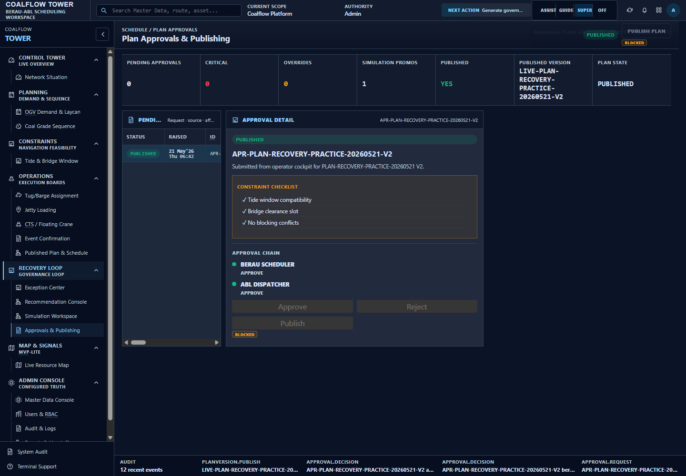

### 17. Open Exports And Handoff

Screen: `Exports & Operational Handoff`

Do this:

1. Confirm the published plan is visible for handoff.
2. Click `Printable schedule`.

Why:

The printable schedule is the operator-readable output for the recovered plan.

You should see:

- Export options.
- `Printable schedule`.
- No generated export yet, or a place where export history will appear.

Works: yes. `Printable schedule` generates the handoff file.

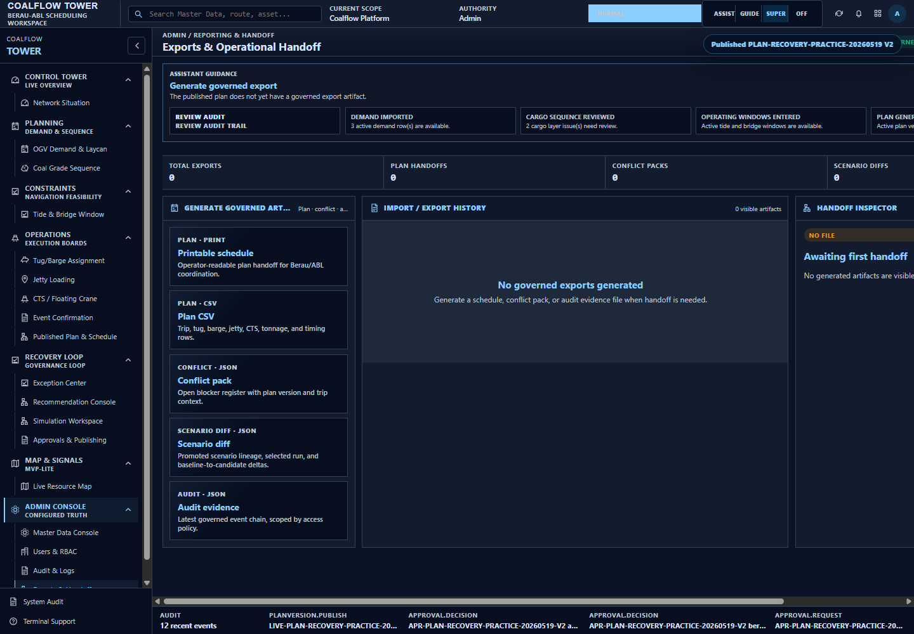

### 18. Confirm The Export Was Generated

Screen: `Exports & Operational Handoff`

Do this:

1. Confirm the export history shows a generated file.
2. Confirm the plan is still `V2`.
3. Confirm the plan is still `published / feasible`.

Why:

This is the end state. The operator has recovered the plan, cleared the blockers, published the plan, and created the handoff output.

You should see:

- A generated printable schedule.
- `PLAN-RECOVERY-PRACTICE-20260519 V2`.
- Published and feasible plan state.
- Open blockers at `0`.

Works: yes. The recovery practice flow is complete.

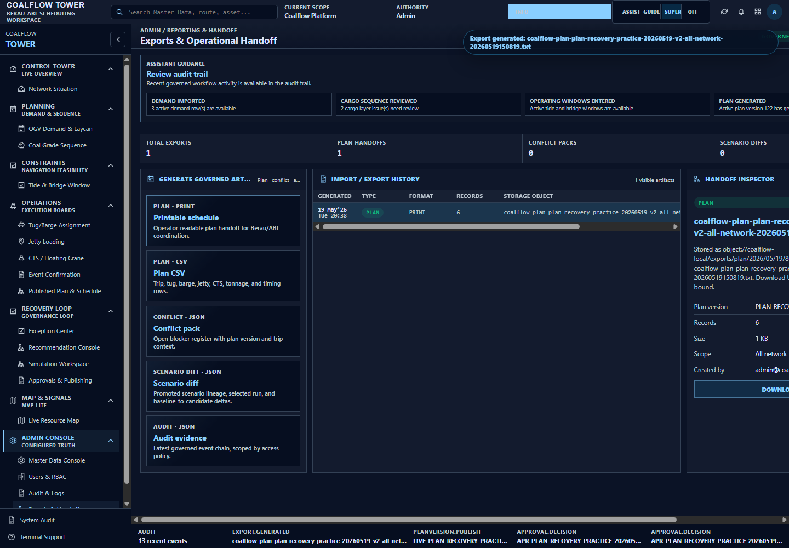

## Buttons Used In This Practice Flow

| Button or card visible in UI | Where the operator clicks it | Result |
|---|---|---|
| `Open Exception Center` | Top blue Assist banner or `Assistant Action Inbox` | Opens `Exception Center` |
| `OGV Demand & Laycan` | Left navigation | Opens the demand board |
| `Tide & Bridge Window` | Left navigation | Opens tide and bridge constraints |
| `Generate recovery options` | `Exception Center` | Opens `Recommendation Console` with ranked options |
| `Create scenario from recommendation` | `Recommendation Console` | Opens `Simulation Workspace` |
| `Run simulation` | `Simulation Workspace` | Runs the selected scenario |
| `Promote to proposed` | `Simulation Workspace` | Promotes the scenario but still leaves blockers in this training case |
| `Enter operating windows` | `Tide & Bridge Window` | Corrects the tide and bridge windows |
| `Regenerate plan` | `Tug/Barge Assignment` | Creates feasible `V2` |
| `Submit approval` | `Published Plan & Schedule` | Opens approval request |
| `Approve` | `Plan Approvals & Publishing` | Records each required approval |
| `Publish plan` | `Plan Approvals & Publishing` | Publishes `V2` |
| `Printable schedule` | `Exports & Operational Handoff` | Generates the handoff export |

No clicked button failed during this pass. The only expected stop is after `Promote to proposed`: the app correctly keeps the plan blocked until the operator fixes tide and bridge windows and regenerates the plan.

## Evidence Files

Capture log:

```text
docs/evidence/assistant_recovery_flow/assist_recovery_flow_capture.json
```

Final state:

```text
docs/evidence/assistant_recovery_flow/recovery_practice_final_state.json
```

Seed summary:

```text
docs/evidence/assistant_recovery_flow/recovery_practice_seed_summary.json
```

Screenshots:

```text
docs/evidence/assistant_recovery_flow/screenshots/
```
