# Assist Super Mode Flow Evidence

Date: 2026-05-19  
Workspace: `F:\ocean`  
Mode tested: Assist `Super`  
User tested: `admin@coalflow.local`

## What Was Reset

The flow started from a master-data-only state:

```powershell
docker compose exec -T api python manage.py seed_phase0 --master-data-only
```

The command reported:

```text
Seeded Phase 1 organizations, roles, users, and master data only. Operational planning, scheduling, export, and audit records are empty.
```

That means the app kept users, roles, permissions, locations, tugs, barges, jetties, CTS assets, coal grades, routes, and other masters. It removed planning demand, schedules, conflicts, approvals, exports, operations events, telemetry records, and audit records.

## Product Fixes Applied Before Final Capture

Two issues blocked a clean Super-mode walkthrough and were fixed before the final evidence run:

1. After a page action such as `Import demand`, the workspace data refreshed but Assist did not refetch its next action. This made Super mode keep showing the old CTA until a route change or reload. The frontend now refreshes Assist after successful workspace actions.
2. After publishing a plan with no export, Assist ranked `Create successor draft` ahead of `Generate governed export`. The backend rule now keeps export handoff first until the published snapshot has a governed export.

## Final State Proved

The flow ended with:

| Area | Result |
|---|---:|
| OGV voyages | 1 |
| Cargo layers | 2 |
| Tide windows | 2 |
| Bridge windows | 2 |
| Navigation checks | 4 |
| Plan versions | 1 published / feasible |
| Trips | 2 |
| Open conflicts | 0 |
| Approval requests | 1 published |
| Approval decisions | 2 |
| Published snapshots | 1 |
| Exports | 1 generated plan print export |

Audit actions created during the flow:

```text
auth.login
planning_import_job.validate
planning.operating_windows.entered
plan.create
planversion.create
planversion.generate
approval.request
approval.decision
approval.decision
planversion.publish
export.generated
```

## Click-By-Click Flow

### 1. Blank Dashboard

What the operator sees: no active plan, no active conflicts, and Super mode recommends `Import OGV demand`.

Assistant next action: `IMPORT_OGV_DEMAND`  
Operator click: `Import OGV demand` in the top bar or action inbox  
Result: Works. It navigates to OGV Demand & Laycan.

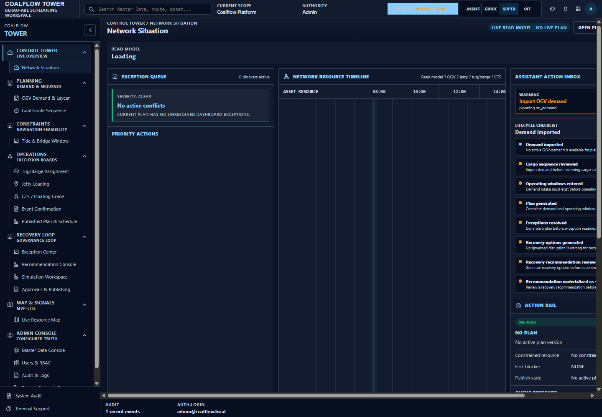

### 2. Demand Board

What the operator sees: OGV demand page with an `Import demand` page button.

Assistant next action: `IMPORT_OGV_DEMAND`  
Operator click: `Import demand`  
Result: Works. It imports one OGV row and creates two cargo layers.

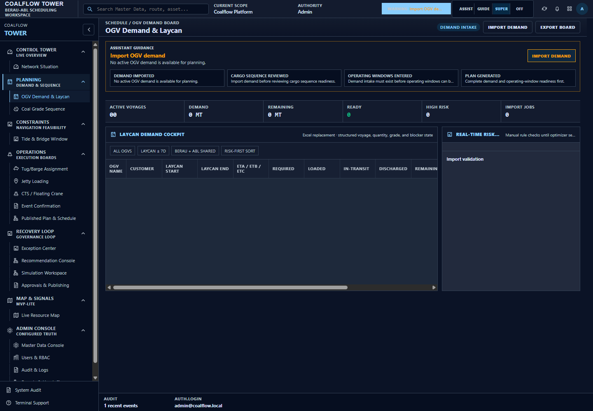

### 3. Demand Imported

What the operator sees: demand is now present. Super mode moves the operator to the missing constraint step.

Assistant next action: `ENTER_OPERATING_WINDOWS`  
Operator click: `Enter tide/bridge windows` in the top bar  
Result: Works. It navigates to Tide & Bridge Window.

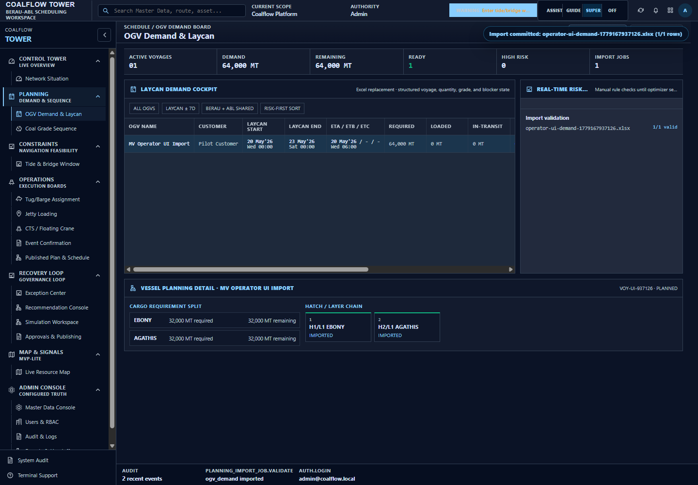

### 4. Tide And Bridge Page

What the operator sees: the constraints page, with `Enter operating windows`.

Assistant next action: `ENTER_OPERATING_WINDOWS`  
Operator click: `Enter operating windows`  
Result: Works. It creates tide windows, bridge windows, asset availability windows, jetty windows, and navigation checks.

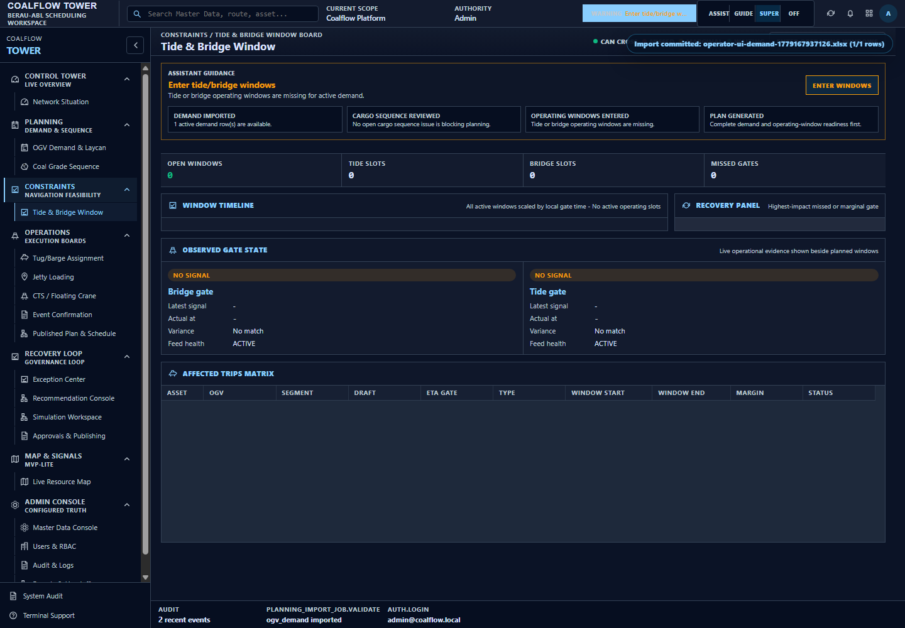

### 5. Operating Windows Entered

What the operator sees: operating-window data is now present. Super mode moves to plan generation.

Assistant next action: `GENERATE_PLAN`  
Operator click: `Generate plan` in the top bar  
Result: Works. It navigates to Tug/Barge Assignment.

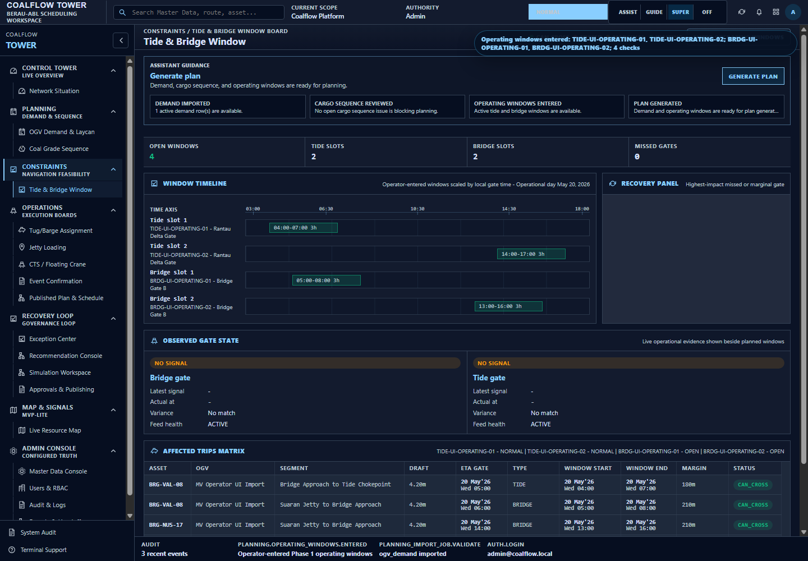

### 6. Assignment Page

What the operator sees: assignment board with a `Regenerate plan` button.

Assistant next action: `GENERATE_PLAN`  
Operator click: `Regenerate plan`  
Result: Works. It creates the first plan version and generates two trips/assignments.

Note: the button works, but the label is confusing in a blank state. For the first plan it should read closer to `Generate plan`.

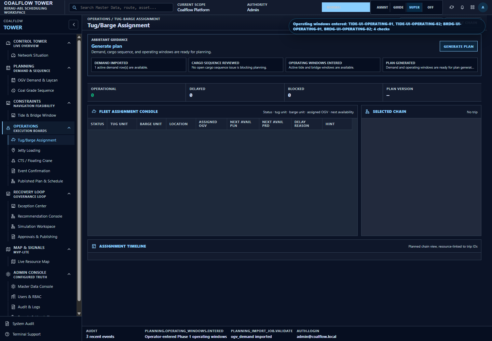

### 7. Plan Generated

What the operator sees: a feasible generated plan with no open conflicts. Super mode moves to approval submission.

Assistant next action: `SUBMIT_APPROVAL`  
Operator click: `Submit approval` in the top bar  
Result: Works. It navigates to Published Plan & Schedule.

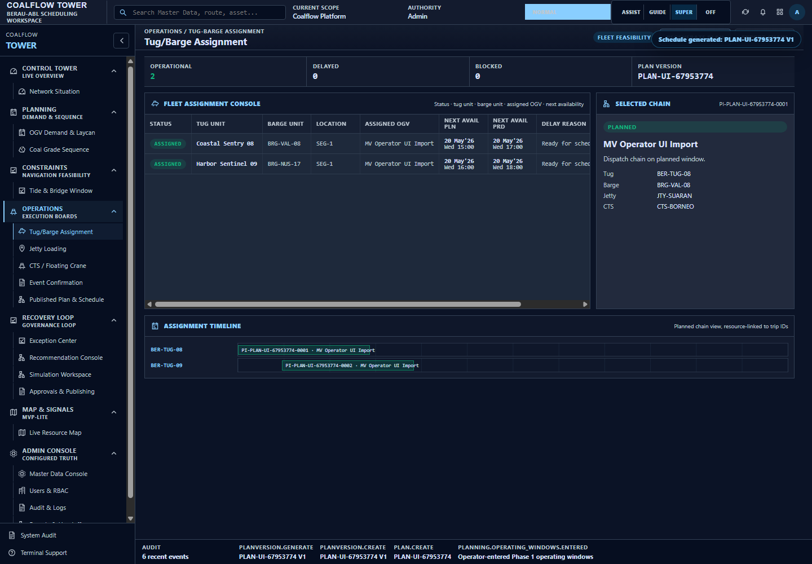

### 8. Published Plan Page

What the operator sees: the generated plan can be submitted into governance.

Assistant next action: `SUBMIT_APPROVAL`  
Operator click: `Submit approval` on the page  
Result: Works. It creates a dual-authority approval request and moves to Approvals & Publishing.

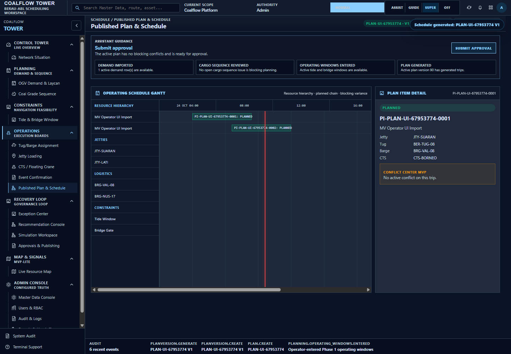

### 9. Approval Request Submitted

What the operator sees: one approval request waiting for authority decisions.

Assistant next action: `APPROVE_PLAN`  
Operator click: `Approve`  
Result: Works. It records the first approval.

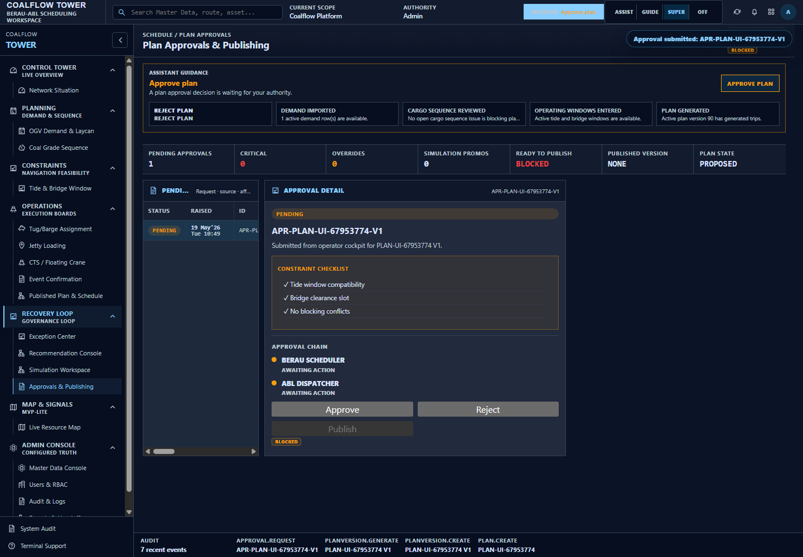

### 10. First Approval Recorded

What the operator sees: the same request still needs the second required authority.

Assistant next action: `APPROVE_PLAN`  
Operator click: `Approve` again  
Result: Works. It records the second approval.

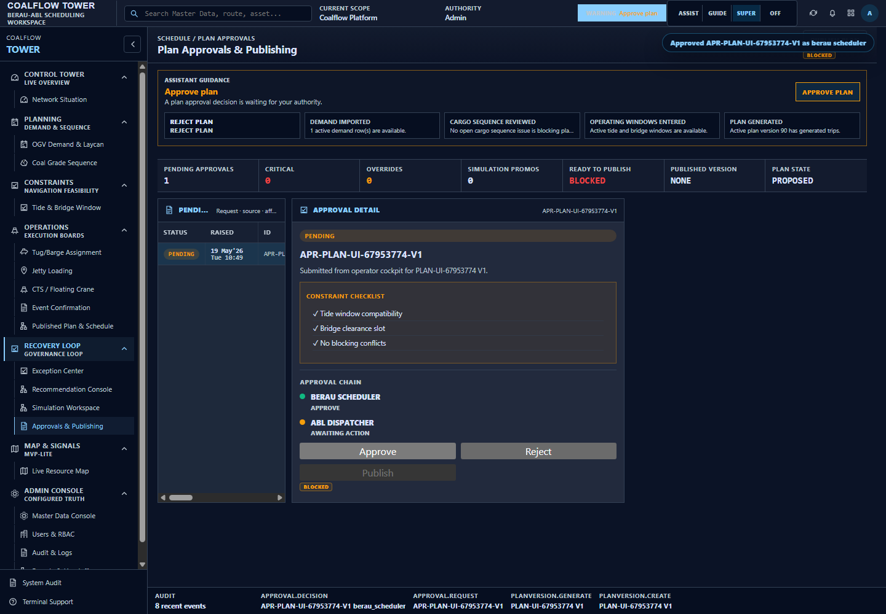

### 11. All Approvals Recorded

What the operator sees: all approvals are complete and publishing is now available.

Assistant next action: `PUBLISH_PLAN`  
Operator click: `Publish plan`  
Result: Works. It creates the immutable published snapshot.

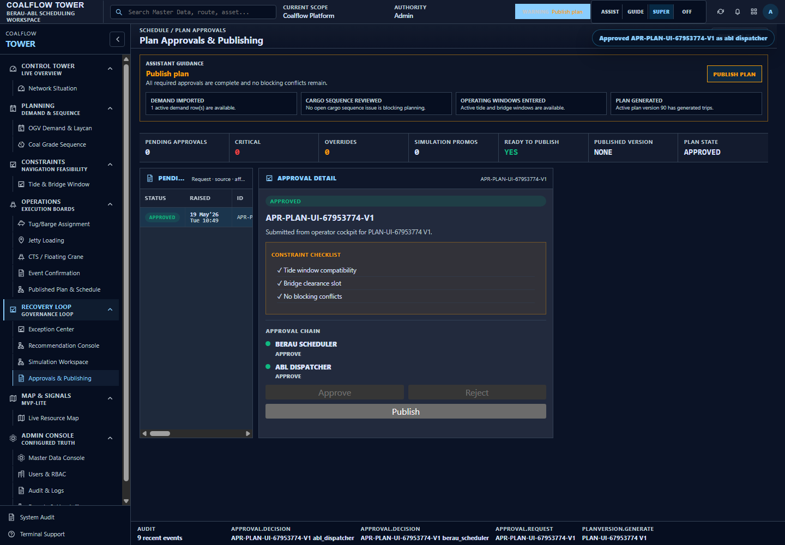

### 12. Plan Published

What the operator sees: plan is published. Super mode now points to governed export handoff.

Assistant next action: `GENERATE_EXPORT`  
Operator click: `Generate governed export` in the top bar  
Result: Works. It navigates to Exports & Handoff.

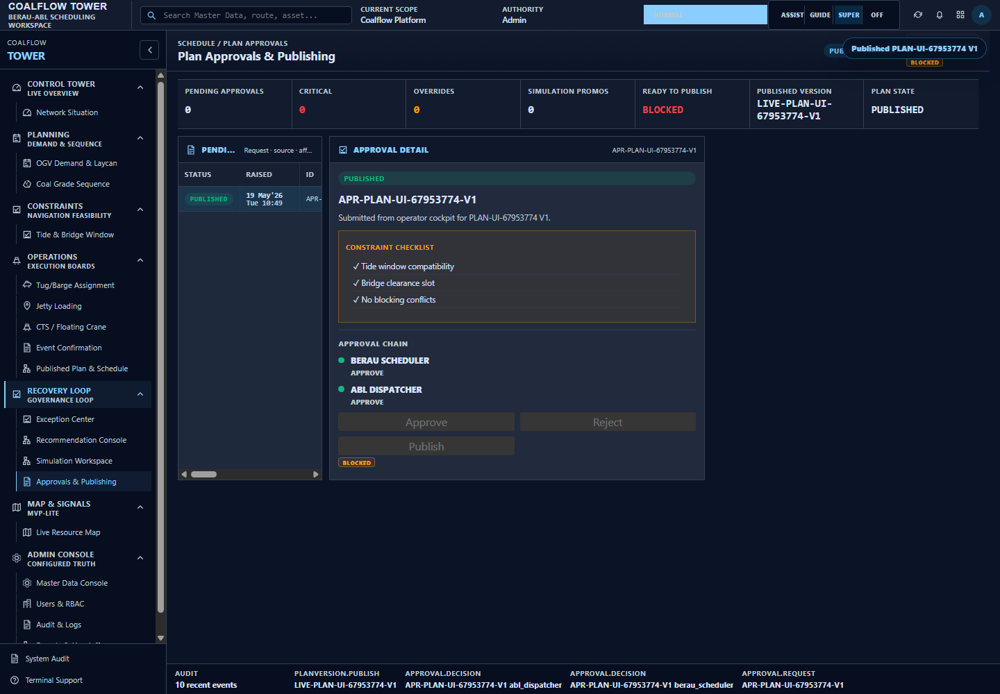

### 13. Export Handoff Page

What the operator sees: export commands are available.

Assistant next action: `GENERATE_EXPORT`  
Operator click: `Printable schedule`  
Result: Works. It generates a plan print export.

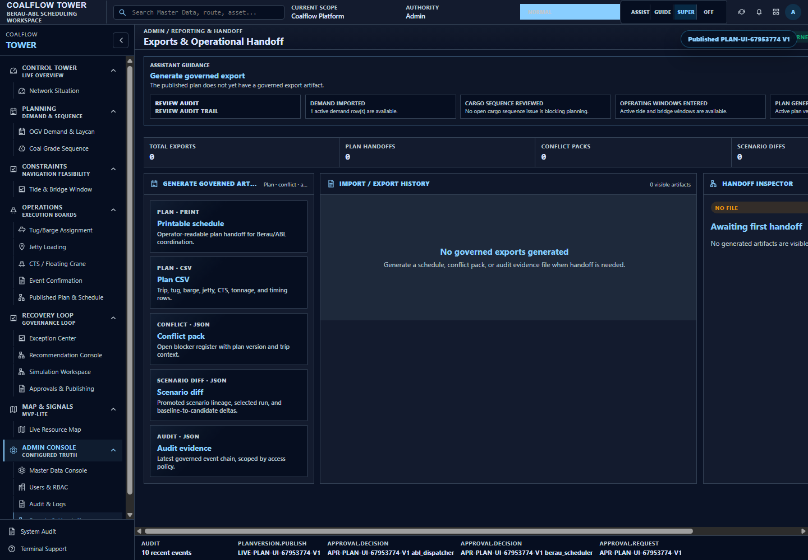

### 14. Governed Export Generated

What the operator sees: export history shows the generated handoff artifact. Super mode moves out of the transaction flow and recommends audit review.

Assistant next action after export: `REVIEW_AUDIT`  
Result: Works. The transaction flow is complete.

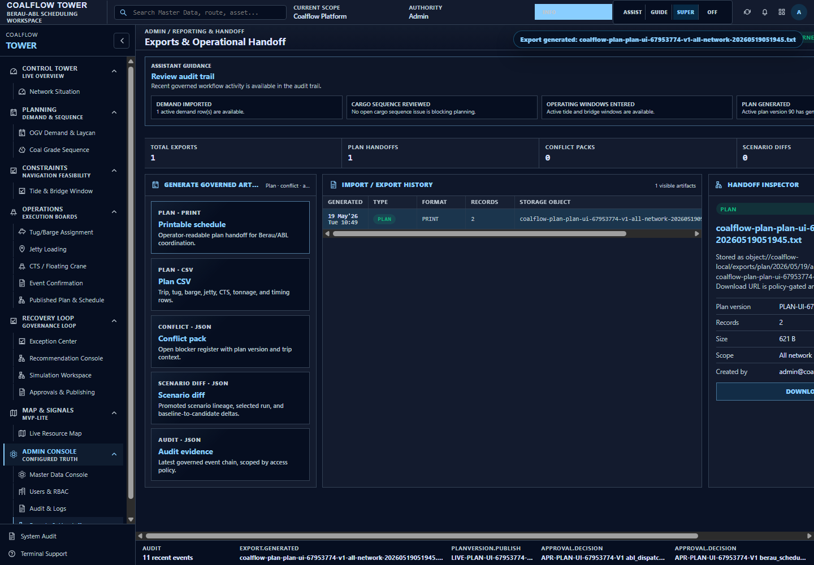

## CTA Status

Working CTAs in this run:

| CTA | Where | Status |
|---|---|---|
| `Import OGV demand` | Super top bar / dashboard inbox | Works |
| `Import demand` | OGV Demand page | Works |
| `Enter tide/bridge windows` | Super top bar | Works |
| `Enter operating windows` | Tide & Bridge page | Works |
| `Generate plan` | Super top bar | Works |
| `Regenerate plan` | Tug/Barge Assignment page | Works, but label is confusing for first generation |
| `Submit approval` | Super top bar and Published Plan page | Works |
| `Approve` | Approvals page | Works for both required approvals |
| `Publish plan` | Approvals page | Works |
| `Generate governed export` | Super top bar | Works |
| `Printable schedule` | Export Handoff page | Works |

CTA caveats:

| Item | Current behavior | Impact |
|---|---|---|
| Duplicate `Import OGV demand` entry | The same recommendation appears in the top bar and the dashboard inbox | Not broken, but visually repetitive |
| `Regenerate plan` wording | First-time generation uses a button labeled `Regenerate plan` | Operator may wonder why they are regenerating when no plan exists |
| Recovery recommendation checklist | Recovery items stay pending in this clean happy path | Expected because no disruption, conflict, override, or tracking alert exists |

## Evidence Files

Raw capture log:

```text
docs/evidence/assistant_super_flow/assist_super_flow_capture.json
```

Capture script:

```text
docs/evidence/assistant_super_flow/capture_super_flow.mjs
```

Screenshots:

```text
docs/evidence/assistant_super_flow/screenshots/
```
