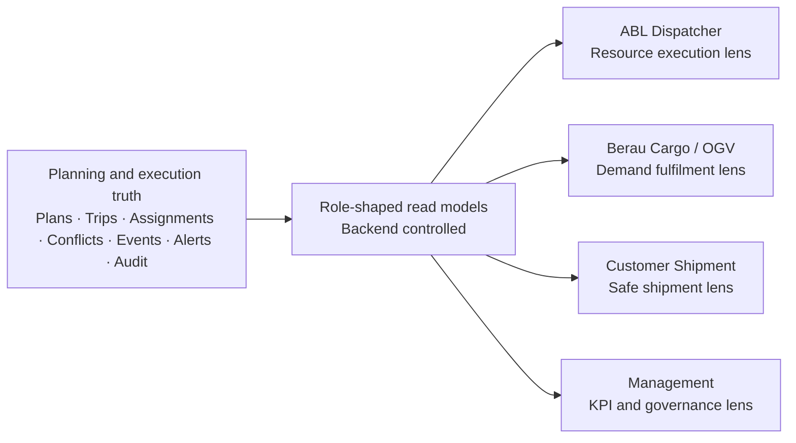

# Phase 6 Multi-Party Control Tower — Visual Thesis and Front-End Development Handoff

**Project:** Coalflow Tower / ABL–Berau transshipment scheduling platform  
**Target phase:** Phase 6 — Multi-party control tower  
**Primary output:** role-shaped control-tower dashboard and related Phase 6 front-end surfaces  
**Prepared from repo snapshot:** `/mnt/data/ocean.zip`, inspected on 2026-05-30

---

## 1. Executive thesis

Phase 6 should not be treated as “one more dashboard.” It is the point where the scheduling product becomes a **multi-party control tower**: ABL, Berau Coal, customers, and management all look at the same operational truth, but each party sees a different safe slice of that truth.

The business specification defines the product as a **constraint-aware coal transshipment scheduling simulation and live planning platform**, not a GPS map, AIS dashboard, Excel clone, or generic fleet-management screen. The same document names the Phase 6 goal as **role-based visibility for ABL, Berau, and customers**, with deliverables for ABL dispatcher view, Berau cargo/OGV view, customer shipment view, management KPI dashboard, and alert escalation/SLA tracking.

The current repo already has a strong Phase 6 foundation:

- `/api/dashboard/situation/` exists as a role-shaped read-model endpoint.
- `DashboardPage.tsx` renders the current **Network Situation** cockpit.
- Backend read-model shaping already distinguishes `network_control`, `demand_control`, and `dispatch_control` profiles.
- Front-end navigation currently exposes one control-tower route: `/dashboard/situation`.
- The existing dashboard shows KPI strip, exception queue, priority actions, network resource timeline, queue pressure, live tracking, operations feed health, drilldowns, recent audit, and Next Action Assist.

The remaining Phase 6 work is therefore **not a greenfield UI build**. It is a controlled expansion from a single network cockpit into four role-shaped control-tower surfaces:

1. **ABL Dispatcher View** — asset, resource, exception, recovery, SLA execution cockpit.
2. **Berau Cargo / OGV View** — OGV readiness, laycan, cargo quantity, grade sequence, customer commitment, loading-risk cockpit.
3. **Customer Shipment View** — safe external shipment status and ETA/risk visibility, without internal asset, commercial, or recovery details.
4. **Management KPI Dashboard** — throughput, delay, utilization, bottleneck, SLA, demurrage exposure projection, and governance health.

---

## 2. Repo status versus business Phase 6 scope

| Phase 6 business deliverable | Current repo evidence | Current status | Front-end implication |
|---|---|---:|---|
| ABL dispatcher view | Backend role shape has `dispatch_control`; ABL role exposes `assetQueue`; dashboard includes queue, resource timeline, live tracking, exceptions. | Partially present | Build ABL-specific route/profile or tab that puts tug/barge, jetty, CTS, exception repair, and SLA breach first. |
| Berau cargo/OGV view | Backend role shape has `demand_control`; Berau role redacts fleet maintenance detail and suppresses `assetQueue`; dashboard KPI includes highest-risk OGV and cargo remaining. | Partially present | Build Berau-specific cargo/OGV cockpit with OGV risk, laycan, cargo remaining, grade sequence, ETA, approval and customer exposure. |
| Customer shipment view | Scope and front-end plan call for customer shipment portal; current nav does not expose a customer route. Backend types include customer-safe ETA fields elsewhere, but no dedicated customer dashboard route was found. | Not fully implemented | Add safe customer portal/route and customer-safe read model; no internal fleet, owner, recovery, or commercial detail. |
| Management KPI dashboard | Current network situation has KPIs, risk score, blockers, queue pressure, governance queue, audit strip. Scope expects throughput, delay, utilization, demurrage risk, bottlenecks. | Partially present | Add management KPI surface with aggregation, trend cards, bottleneck ranking, SLA aging, demurrage projection labels, and export/governance summary. |
| Alert escalation and SLA tracking | Exception center and tracking alerts exist; seed instructions mention exception owner, SLA deadline, and SLA breached cases. Current dashboard shows open and critical tracking alerts but not a full SLA lane. | Partially present | Add alert/SLA lane to all Phase 6 views, with owner, age, deadline, escalation level, breach state, and next action. |

**Interpretation:** Chunk 6 in the repo appears to have closed the **internal network situation board**. Business Phase 6 needs the next layer: **role-separated operating surfaces and external/customer-safe visibility**.

---

## 3. What must not change

The following implementation truths must be preserved while building Phase 6 UI:

- The backend remains the authority for visibility, redaction, permissions, and read-model shaping.
- The front end must not infer or calculate business-sensitive visibility from raw data.
- The UI must not expose ABL-only asset/commercial details to Berau/customer roles.
- The UI must not expose Berau/customer commitment details to ABL roles unless the backend explicitly includes them.
- Customer view must show **status and safe projections**, not internal recovery logic, asset owner, approval politics, or final settlement/demurrage calculation.
- Commercial/demurrage values must be labelled as **projection**, not settlement.
- Phase 6 does not permit automatic publish; approval authority remains with Berau, ABL, and joint-control roles.
- The visual language must remain dark, dense, operational, and cockpit-like. No marketing-style dashboards or hero layouts.

---

## 4. Visual thesis

### 4.1 One operating truth, four role lenses



The dashboard must feel like one control tower, but each user enters through their role lens:

- ABL asks: **Which physical move is blocked, who owns it, and what do we do next?**
- Berau asks: **Which OGV/cargo commitment is at risk, and is the grade/quantity/laycan still achievable?**
- Customer asks: **Where is my shipment, what is the safe ETA, and is there a risk?**
- Management asks: **Where is the system losing time, capacity, throughput, and governance control?**

### 4.2 Phase 6 navigation concept

```text
/control-tower
  /network-situation        Existing internal cockpit; joint/network view
  /abl-dispatch             ABL dispatcher view
  /berau-cargo-ogv          Berau cargo / OGV view
  /customer-shipments       Customer-safe shipment portal
  /management-kpis          Management KPI dashboard
  /alerts-sla               Cross-party escalation and SLA workbench
```

The current repo route `/dashboard/situation` can remain as an alias or be retained as the network situation route. The new Phase 6 surfaces should reuse the same shell, KPI-card primitives, dense grid styling, action rail, audit strip, and Next Action Assist components.

### 4.3 Screen-level layout thesis

Every Phase 6 control-tower surface should follow the same five-zone layout:

```text
┌─────────────────────────────────────────────────────────────────────────────┐
│ Sticky page header: role lens + live plan/version + timestamp + key CTAs     │
├─────────────────────────────────────────────────────────────────────────────┤
│ KPI strip: 5–7 role-specific live metrics, each drillable                    │
├───────────────────────────────┬─────────────────────────────────────────────┤
│ Main operating board           │ Timeline / map / queue / OGV progression    │
│ Role-specific rows             │ Role-specific visualization                 │
├───────────────────────────────┴─────────────────────────────────────────────┤
│ Alert + SLA lane: owner, age, deadline, escalation, next action              │
├─────────────────────────────────────────────────────────────────────────────┤
│ Right rail: Next Action Assist, drilldowns, audit, feed trust, export state  │
└─────────────────────────────────────────────────────────────────────────────┘
```

### 4.4 Role-specific visual emphasis

| View | Dominant board | Dominant KPI | Dominant action |
|---|---|---|---|
| ABL dispatcher | Tug/barge/jetty/CTS queue and timeline | Fleet/resource readiness | Repair execution blocker |
| Berau cargo/OGV | OGV cargo fulfilment and grade sequence | Cargo remaining / OGV risk | Protect laycan and grade sequence |
| Customer shipment | Shipment milestone tracker | ETA and risk state | View status / subscribe / contact control tower |
| Management KPI | Aggregated throughput and bottleneck board | Delay, utilization, SLA, demurrage projection | Escalate structural bottleneck |

---

## 5. Front-end development handoff

### 5.1 Build objective

Develop the Phase 6 front-end UI layer by extending the existing `DashboardPage.tsx` and read-model conventions into a set of role-aware control-tower surfaces. The implementation should rely on Phase 6 scope from `docs/02_Planning_Tool_Scope.md`, current visual standards in `docs/07_Frontend_Build_Handoff_and_Phasewise_Plan.md`, and the existing dashboard read-model pattern in `backend/apps/scheduling/read_models.py`.

### 5.2 Current implementation anchors

| Anchor | Repo path | Use in Phase 6 |
|---|---|---|
| Current dashboard route | `frontend/src/lib/navigation.ts` | Extend control-tower navigation with new Phase 6 routes. |
| Current dashboard page | `frontend/src/pages/DashboardPage.tsx` | Refactor reusable components from Network Situation into role-specific pages. |
| Dashboard type contract | `frontend/src/types.ts` | Add Phase 6 read-model types without weakening existing `DashboardReadModel`. |
| Dashboard API fetch | `frontend/src/App.tsx` | Add fetches for Phase 6 role dashboards or route-param-driven control tower endpoint. |
| Backend read model | `backend/apps/scheduling/read_models.py` | Ask backend agent to add role-specific payloads; front end consumes only shaped payload. |
| API endpoint | `backend/apps/scheduling/views.py` | Current `/api/dashboard/situation/` pattern should be copied for Phase 6 endpoints. |
| Assistant UI | `frontend/src/components/assistant/*` | Reuse action inbox/guided checklist for role-specific Next Action. |
| Visual system | `frontend/src/styles.css` | Preserve dense, dark, sticky-header cockpit style. |

### 5.3 Recommended front-end route implementation

Add these nav items under `Control Tower`:

```ts
{
  path: "/control-tower/network-situation",
  label: "Network Situation",
  requiredPermission: "dashboard.view",
}
{
  path: "/control-tower/abl-dispatch",
  label: "ABL Dispatch Control",
  requiredPermission: "dashboard.view",
}
{
  path: "/control-tower/berau-cargo-ogv",
  label: "Berau Cargo / OGV",
  requiredPermission: "dashboard.view",
}
{
  path: "/control-tower/customer-shipments",
  label: "Customer Shipments",
  requiredPermission: "customer_portal.view", // backend permission to confirm
}
{
  path: "/control-tower/management-kpis",
  label: "Management KPIs",
  requiredPermission: "dashboard.management_view", // backend permission to confirm
}
{
  path: "/control-tower/alerts-sla",
  label: "Alerts & SLA",
  requiredPermission: "exceptions.view",
}
```

Keep `/dashboard/situation` working until migration is complete. Do not break existing tests that expect `Network Situation` to be visible with `dashboard.view`.

### 5.4 Component decomposition

Refactor the current `DashboardPage.tsx` into reusable Phase 6 primitives:

```text
frontend/src/pages/controlTower/
  ControlTowerRouter.tsx
  NetworkSituationPage.tsx
  AblDispatchControlPage.tsx
  BerauCargoOgvPage.tsx
  CustomerShipmentsPage.tsx
  ManagementKpiPage.tsx
  AlertsSlaPage.tsx

frontend/src/components/controlTower/
  ControlTowerHeader.tsx
  RoleLensTabs.tsx
  KpiStrip.tsx
  ExceptionQueuePanel.tsx
  SlaEscalationLane.tsx
  ResourceTimelinePanel.tsx
  OgvRiskBoard.tsx
  CargoFulfilmentBoard.tsx
  CustomerShipmentTracker.tsx
  ManagementBottleneckBoard.tsx
  FeedTrustPanel.tsx
  GovernanceQueuePanel.tsx
```

Do not copy-paste the existing page four times. Extract reusable primitives first, then compose role pages.

---

## 6. Role view specifications

### 6.1 ABL Dispatcher View

**Route:** `/control-tower/abl-dispatch`  
**Primary user:** ABL dispatch/planning team  
**Goal:** recover execution and resource constraints fast.

#### Above-the-fold KPIs

| KPI | Meaning | Drilldown |
|---|---|---|
| Active tug/barge pairs | Count of scheduled/active pairs in current horizon | Tug/Barge Assignment |
| Blocked assets | Tug/barge/CTS/jetty blockers | Exception Center |
| Queue pressure | Peak jetty/CTS congestion | Jetty/CTS boards |
| Tide/bridge risk | Open tide/bridge conflicts | Tide & Bridge Window |
| SLA breaches | Escalations past deadline | Alerts & SLA |
| Publish blockers | Unresolved blockers preventing plan publish | Published Plan / Exceptions |

#### Main board

Dense table grouped by execution chain:

```text
OGV → cargo layer → origin jetty → barge → tug → route/window → CTS → planned finish → state → blocker → next action
```

Columns:

- trip ID
- OGV
- jetty
- tug
- barge
- CTS
- planned depart/arrive
- latest ETA variance
- operational status
- blocker code
- SLA deadline
- owner
- next action

#### Right rail

- Next Action Assist.
- Critical blockers.
- Feed trust / GPS-AIS stale alerts.
- Recent override/audit events.

#### Redaction rule

ABL view may show asset/resource detail, but must not show customer commercial exposure unless backend explicitly includes a safe projection.

---

### 6.2 Berau Cargo / OGV View

**Route:** `/control-tower/berau-cargo-ogv`  
**Primary user:** Berau scheduling/commercial team  
**Goal:** protect cargo commitment, laycan, loading sequence, and OGV fulfilment.

#### Above-the-fold KPIs

| KPI | Meaning | Drilldown |
|---|---|---|
| Highest-risk OGV | OGV with largest risk or blocking conflict | OGV Demand |
| Cargo remaining | Remaining planned MT versus loaded MT | Coal Grade Sequence |
| Grade sequence risk | Open cargo/layer/hatch issues | Coal Grade Sequence |
| Laycan risk | ETA/ETB or completion risk versus laycan | OGV board |
| Approval pressure | Pending Berau/ABL/joint approvals | Plan Approvals |
| Customer-safe ETA variance | Delay projection safe to share | Customer Shipment View |

#### Main board

OGV-centric list:

```text
OGV · customer · laycan · target MT · loaded MT · remaining MT · coal grade sequence · last safe ETA · risk reason · approval state · action
```

#### Visualization

Use an OGV progress stack:

```text
[OGV] [Layer 1 grade/MT] [Layer 2 grade/MT] [Layer 3 grade/MT] [remaining] [risk marker]
```

#### Redaction rule

Berau view may show demand, cargo, OGV, grade, approval, and customer-commitment risk. It should not show fleet maintenance detail or ABL internal asset-commercial ownership details unless backend includes them.

---

### 6.3 Customer Shipment View

**Route:** `/control-tower/customer-shipments`  
**Primary user:** customer / external stakeholder  
**Goal:** show safe shipment status, progress, risk, and ETA without exposing internal operations.

#### Above-the-fold KPIs

| KPI | Meaning |
|---|---|
| Shipments visible | Count of customer-visible OGV/voyage records |
| On track | Shipments without material risk |
| At risk | Shipments with safe risk classification |
| Latest ETA | Customer-safe ETA / delivery milestone |
| Last update | Latest confirmed or safe projected update |

#### Main board

Shipment card list:

```text
Shipment / OGV / cargo grade / planned window / current milestone / safe ETA / risk level / last confirmed update
```

#### Customer milestone tracker

```text
Demand confirmed → Cargo planned → Loading started → In transshipment → OGV loading → Completed / departed
```

#### Hard exclusions

Never show:

- tug identity unless explicitly approved;
- barge identity unless explicitly approved;
- CTS maintenance details;
- internal exception owner names;
- recovery recommendation internals;
- approval conflict details;
- commercial exposure or demurrage settlement;
- raw GPS/AIS if it is untrusted or not customer-safe.

Use labels like:

- `On track`
- `At risk — weather/tide window`
- `At risk — loading delay`
- `Delayed — recovery plan under review`
- `Completed`

---

### 6.4 Management KPI Dashboard

**Route:** `/control-tower/management-kpis`  
**Primary user:** management / joint control tower  
**Goal:** understand throughput, bottlenecks, delay, utilization, SLA health, and governance health.

#### KPI groups

| KPI group | Metrics |
|---|---|
| Throughput | planned MT, loaded MT, completed MT, remaining MT, OGV completion rate |
| Delay | average delay minutes, max ETA variance, delayed trips, laycan breach risk |
| Utilization | tug utilization, barge utilization, CTS utilization, jetty occupancy |
| Bottleneck | top constrained resource, top conflict code, queue peak, tide/bridge losses |
| SLA | open alerts, breached alerts, average age, escalation owner spread |
| Governance | pending approvals, publish blockers, override count, audit events |
| Commercial projection | demurrage exposure projection, delay exposure projection, labelled non-settlement |

#### Main board

Management view should be a ranked bottleneck board:

```text
Rank · bottleneck · impacted OGVs · impacted MT · delay minutes · SLA breaches · owner group · trend · action
```

#### Visuals

Use simple dense cards and ranked bars; avoid decorative charts. Every chart must answer: **where should management intervene?**

---

### 6.5 Alerts & SLA Workbench

**Route:** `/control-tower/alerts-sla`  
**Primary users:** all internal roles, shaped by permission  
**Goal:** centralize alert ownership, escalation, SLA aging, and next action.

#### Board columns

```text
Severity · alert type · affected OGV/asset · owner team · created at · SLA deadline · age · breach state · escalation level · recommended action · route
```

#### SLA states

- `within_sla`
- `due_soon`
- `breached`
- `escalated_l1`
- `escalated_l2`
- `closed`

#### Interaction rules

- Every alert row must drill into its source page.
- The row must show the owner and next recommended action.
- Escalation actions must be permission-gated and audit-backed.
- Customer-facing views must receive only safe alert labels, not internal alert taxonomy unless approved.

---

## 7. API and type contract handoff

### 7.1 Preferred backend endpoints

Ask the backend agent to expose one endpoint per lens, or one lens-param endpoint. Prefer separate endpoints for clarity and easier tests:

```text
GET /api/control-tower/network-situation/
GET /api/control-tower/abl-dispatch/
GET /api/control-tower/berau-cargo-ogv/
GET /api/control-tower/customer-shipments/
GET /api/control-tower/management-kpis/
GET /api/control-tower/alerts-sla/
```

Each endpoint must enforce permissions and redaction server-side.

### 7.2 Shared payload shape

```ts
type ControlTowerReadModel = {
  generatedAt: string;
  lens: "network" | "abl_dispatch" | "berau_cargo_ogv" | "customer_shipments" | "management_kpis" | "alerts_sla";
  roleShape: {
    profile: string;
    organizationName: string;
    organizationKind: string;
    dataScope: string;
    sections: Record<string, boolean>;
    redactions: string[];
  };
  livePlan: {
    planCode: string | null;
    versionNo: number | null;
    publishState: string;
    liveSnapshotId: string | null;
  };
  kpis: ControlTowerKpi[];
  primaryRows: unknown[];       // concrete per-lens row type in front-end discriminated union
  alertsSla: SlaAlertSummary[];
  nextActions: ControlTowerAction[];
  drilldowns: ControlTowerDrilldown[];
  feedTrust?: FeedTrustSummary;
  auditSummary?: AuditSummary;
};
```

### 7.3 Front-end discriminated union

```ts
type ControlTowerPayload =
  | NetworkSituationPayload
  | AblDispatchPayload
  | BerauCargoOgvPayload
  | CustomerShipmentsPayload
  | ManagementKpiPayload
  | AlertsSlaPayload;
```

Each payload must include `lens`, so rendering is deterministic and not role-name guessed in the UI.

### 7.4 Customer-safe payload requirements

Customer payload must be positive-list shaped. Do not send redacted internal fields and hide them in the UI. Backend should only send fields that are safe to render.

Minimum customer row:

```ts
type CustomerShipmentRow = {
  shipmentId: string;
  ogvName: string;
  customerName: string;
  cargoGradeLabel: string;
  plannedWindowLabel: string;
  currentMilestone: string;
  customerSafeEta: string | null;
  riskLabel: "on_track" | "at_risk" | "delayed" | "completed";
  riskExplanation: string;
  lastConfirmedUpdateAt: string | null;
};
```

---

## 8. Build chunks for Codex / implementation agent

### Chunk 6.1 — Route shell and component extraction

**Goal:** introduce Phase 6 routes without changing existing behavior.

Tasks:

1. Add `frontend/src/pages/controlTower/` folder.
2. Extract reusable pieces from `DashboardPage.tsx`:
   - `KpiStrip`
   - `ExceptionQueuePanel`
   - `ResourceTimelinePanel`
   - `ControlTowerHeader`
   - `SlaEscalationLane`
3. Keep `/dashboard/situation` rendering unchanged.
4. Add new routes as disabled or feature-flagged until backend payloads exist.
5. Add route tests to ensure existing nav still passes.

Acceptance:

- Existing dashboard tests continue to pass.
- No visible regression in Network Situation.
- New components receive typed props, not raw broad `any`.

### Chunk 6.2 — ABL Dispatch Control page

Tasks:

1. Add `AblDispatchControlPage.tsx`.
2. Add ABL dispatcher row type.
3. Render resource chain board and SLA lane.
4. Reuse live tracking and feed health cards.
5. Wire route to backend payload or temporary adapter over current dashboard payload if backend is not ready.

Acceptance:

- ABL role sees dispatch lens.
- Berau/customer roles do not see restricted asset detail.
- Blocked asset, queue pressure, and SLA breach states are visible.

### Chunk 6.3 — Berau Cargo / OGV page

Tasks:

1. Add `BerauCargoOgvPage.tsx`.
2. Add OGV/cargo fulfilment board.
3. Add cargo progress and grade sequence risk components.
4. Add laycan/ETA risk KPI cards.
5. Hide fleet maintenance and ABL-only asset ownership details.

Acceptance:

- Berau role sees OGV/cargo commitment lens.
- Cargo remaining and grade sequence risks drill into planning boards.
- No asset-maintenance internal detail leaks.

### Chunk 6.4 — Customer shipment portal

Tasks:

1. Add `CustomerShipmentsPage.tsx`.
2. Add customer-safe shipment card and milestone tracker.
3. Add positive-list rendering only.
4. Add empty state and unauthorized state.
5. Add tests for absence of internal field labels.

Acceptance:

- Customer role sees only safe shipment records.
- Internal conflict codes, asset owners, recovery details, and settlement values do not render.
- ETA is labelled as confirmed or projected according to payload.

### Chunk 6.5 — Management KPI dashboard

Tasks:

1. Add `ManagementKpiPage.tsx`.
2. Add KPI groups and bottleneck ranking board.
3. Add demurrage/commercial projection card with mandatory `projection` label.
4. Add SLA aging summary.
5. Add governance health panel.

Acceptance:

- Management role sees throughput, delay, utilization, bottleneck, SLA, governance, and projection cards.
- Commercial values are never labelled as final settlement.
- Each card drills into source board.

### Chunk 6.6 — Alerts & SLA Workbench

Tasks:

1. Add `AlertsSlaPage.tsx`.
2. Add SLA state chips and escalation level chips.
3. Add owner/team filter, severity filter, breached-only filter.
4. Wire row CTAs to source page.
5. Integrate Next Action Assist for top escalation action.

Acceptance:

- Breached, due soon, and open alerts are visually distinct.
- Escalation actions are permission-gated.
- All mutation CTAs call backend endpoints that audit.

### Chunk 6.7 — Regression and evidence

Tasks:

1. Add Vitest component tests for all new pages.
2. Add permission/redaction tests.
3. Add screenshot/evidence script equivalent to existing phase capture scripts.
4. Update documentation index and operator runbook.

Acceptance:

- Existing `/dashboard/situation` path still works.
- Phase 6 routes render with loading, empty, error, and data states.
- Role redaction tests exist for ABL, Berau, customer, and management roles.

---

## 9. UI acceptance checklist

| Check | Acceptance rule |
|---|---|
| Role safety | UI renders only what backend sends; no client-side hidden internal fields in customer view. |
| Dense cockpit style | Sticky header, compact grid, dark theme, no hero cards. |
| Drilldown | Every KPI and row action navigates to a source board. |
| Alert/SLA | Open alerts show owner, deadline, age, breach status, escalation level. |
| Next Action | Each view shows the top relevant next action when assistant mode is on. |
| Feed trust | Live/GPS/AIS values show trust/staleness state where relevant. |
| Commercial safety | Demurrage/commercial cards are projection-only and not settlement. |
| No authority bypass | No publish, approval, escalation, override, or export mutation occurs without backend permission and audit. |
| Backward compatibility | `/dashboard/situation` and existing tests remain valid. |

---

## 10. Test observations from this repo review

I attempted local tests from the extracted repo snapshot:

- Front-end test command attempted: `cd frontend && npm test -- --runInBand`.
  - Result: failed before test execution because `vitest` was not executable in the extracted environment: `sh: 1: vitest: Permission denied`.
- Backend dashboard test attempted: `cd backend && python -m pytest apps/scheduling/tests/test_dashboard_read_model.py -q`.
  - Result: failed during import because Django dependencies are not installed in this runtime: `ModuleNotFoundError: No module named 'django'`.

So this handoff is based on repository static inspection and existing committed test/spec files, not a fresh green test run.

---

## 11. Tight implementation prompt for Codex

Use this as the working prompt for the build agent:

```text
Read agent.md first. Then read docs/02_Planning_Tool_Scope.md, docs/07_Frontend_Build_Handoff_and_Phasewise_Plan.md, docs/09_Ch0_Ch6_Implementation_Validation.md, and docs/26_Phase_6_Phase_5_Plus_Implementation_Spec.md.

Objective: implement Phase 6 Multi-party Control Tower front-end surfaces without breaking the existing Network Situation dashboard.

Business scope: Phase 6 requires role-based visibility for ABL, Berau, and customers: ABL dispatcher view, Berau cargo/OGV view, customer shipment view, management KPI dashboard, alert escalation and SLA tracking.

Current repo baseline: /api/dashboard/situation/ and frontend/src/pages/DashboardPage.tsx already provide a role-shaped Network Situation cockpit. Treat this as the baseline visual and contract pattern, not as something to replace.

Build in chunks:
1. Extract reusable control-tower components from DashboardPage.tsx while preserving /dashboard/situation behavior.
2. Add Control Tower routes for ABL Dispatch, Berau Cargo/OGV, Customer Shipments, Management KPIs, and Alerts/SLA.
3. Add typed payloads as discriminated unions; never use client-side role guessing for sensitive visibility.
4. Build ABL view around asset queue, resource timeline, blockers, tracking, and SLA.
5. Build Berau view around OGV risk, cargo remaining, grade sequence, laycan, ETA and approvals.
6. Build Customer view as positive-list only: safe shipment status, safe ETA, risk label, milestone tracker. Do not render internal conflict codes, asset owners, recovery internals, or settlement values.
7. Build Management KPI view around throughput, delay, utilization, bottleneck, SLA, governance, and commercial projection labelled as projection.
8. Build Alerts/SLA workbench with owner, deadline, age, breach state, escalation state, and source drilldown.
9. Reuse Next Action Assist components on every internal view.
10. Add tests for route visibility, loading/error/empty states, role redaction, and customer-safe rendering.

Constraints:
- Backend remains authority for permission and redaction.
- Do not make UI-only hiding a security boundary.
- Do not add automatic publish or bypass approval.
- Preserve dark dense cockpit visual standard.
- Preserve existing tests and route behavior for /dashboard/situation.
```

---

## 12. Immediate next build recommendation

Start with **Chunk 6.1 component extraction and route shell**. It has the lowest business risk and unlocks all later Phase 6 work. The first visible deliverable should be a route group under Control Tower where only Network Situation is fully active and the new Phase 6 surfaces render structured placeholders tied to their intended backend payloads.

After that, build **ABL Dispatch** and **Berau Cargo/OGV** before customer view, because they reuse the most current repo truth and will validate the role-lens model before external visibility is introduced.
