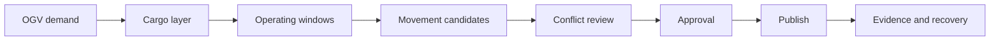
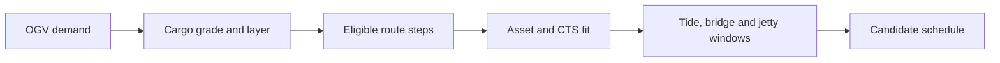
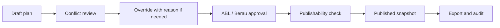
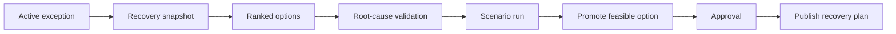
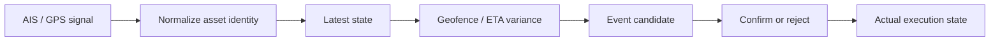

# ABL Client Presentation - 15 Slide Content Blueprint

## Deck Intent

The presentation should explain the proposed product as an operating system for synchronized transshipment planning, not as a generic scheduling tool. The first seven slides align the client on the operating problem and Vector's approach. Slides 8 to 13 shift into product demonstration blocks. Slides 14 and 15 close with delivery roadmap, Release 1 focus and client alignment.

The deck should use minimal text. Each slide should carry one main statement, one strong visual artifact and only the smallest supporting labels needed to guide the conversation.

## Locked Flow

| Slide | Title | Block | Primary job of the slide |
| --- | --- | --- | --- |
| 1 | Proposal Context & Operating Reality | Opening | Establish why ABL's operating flow needs synchronized planning |
| 2 | Problem Statement | Opening | Frame the business pain clearly |
| 3 | Root Cause Perspective | Opening | Align the problem through a CCR-based operating lens |
| 4 | Core Operating Philosophy | Opening | Explain how moving constraints shape the solution |
| 5 | Vector Approach & Proprietary Scaffolding | Opening | Show Vector's solution base and ABL-specific configuration |
| 6 | Product Concept | Opening | Show the end-to-end product flow |
| 7 | Release 1 Product Layer | Opening | Define the first usable product outcome |
| 8 | Application Modules & Master Data Spine | Demo Block 1 | Familiarize the client with modules and controlled operating data |
| 9 | OGV Demand To Feasible Schedule | Demo Block 1 | Demonstrate happy-path planning from demand to feasible movement |
| 10 | Approval, Publish & Audit Trail | Demo Block 1 | Demonstrate controlled approval, publish and audit |
| 11 | Scenario & Exception Flow | Demo Block 2 | Explain disruption modelling and scenario comparison |
| 12 | Recovery Path To Publish | Demo Block 2 | Demonstrate recovery from exception to approved recovery publication |
| 13 | Telemetry Evidence & Operational Monitoring | Demo Block 3 | Demonstrate evidence-based asset state and visual monitoring |
| 14 | Delivery Roadmap: Release 1 Focus | Delivery Block | Explain blueprinting, sprint flow and Release 1 validation |
| 15 | Adoption Review & Client Alignment | Delivery Block | Close with readiness decisions, governance and next actions |

---

## Slide 1 - Proposal Context & Operating Reality

**What it must convey:** ABL's transshipment operation is a connected operating flow. Each decision affects cargo readiness, jetty loading, tug-barge movement, tide and bridge windows, CTS availability and OGV loading commitments.

**How to convey it:** Use a full-slide SVG operating system map. Place Berau demand on the left, ABL logistics flow in the center and OGV commitment on the right. Show tide, bridge, jetty, CTS and fleet availability as moving constraint badges around the flow.

**Minimal on-slide text:**

> ABL needs synchronized planning across a moving transshipment flow.

**Speaker emphasis:** The proposal is not only about digitizing a schedule. It is about creating a governed way to synchronize demand with executable flow capacity.

**Visual artifact:** SVG flow map with nodes: Berau Demand, Cargo Readiness, Jetty/BLC, Tug-Barge, Tide/Bridge, CTS, OGV.

---

## Slide 2 - Problem Statement

**What it must convey:** The pain comes from repeated replanning, fragmented inputs and manual coordination under changing constraints.

**How to convey it:** Use a visual "planning stress loop": demand plan, spreadsheet, WhatsApp/phone coordination, manual judgement, field changes and revised schedule looping back into planning.

**Minimal on-slide text:**

> Planning changes faster than manual coordination can stabilize it.

**Speaker emphasis:** The operational pain is visible as missed OGV dates, underutilized assets, repeated reassignment, excessive waiting and limited simulation-backed decision support.

**Visual artifact:** Circular loop diagram with five pain tags: missed schedule, waiting, reassignment, underutilization, reactive escalation.

---

## Slide 3 - Root Cause Perspective

**What it must convey:** The core issue is a synchronization issue. Demand commitments are not continuously tested against the current capacity of the controlling operational constraint.

**How to convey it:** Use a CCR-based lens without over-explaining CCR. Show one flow line where the active constraint shifts from cargo readiness to jetty, tide, bridge, tug-barge, CTS and OGV laycan pressure.

**Minimal on-slide text:**

> The active constraint moves. The plan must move with it.

**Speaker emphasis:** A static plan becomes fragile because the limiting factor changes during the day. The system must identify where flow is actually constrained at planning and recovery moments.

**Visual artifact:** Constraint handoff ribbon with one highlighted active constraint at a time.

---

## Slide 4 - Core Operating Philosophy

**What it must convey:** The solution must schedule around active operating windows, resource eligibility and current execution state.

**How to convey it:** Use a feasibility gate visual. Inputs enter from the left: demand, cargo, asset, route, tide, bridge, jetty and CTS. The gate produces either feasible movement candidates or reason-coded blockers.

**Minimal on-slide text:**

> Every movement must pass through eligible resources and valid operating windows.

**Speaker emphasis:** Planner discretion remains, but it becomes governed. Overrides are allowed when required, but with reason, approval and audit.

**Visual artifact:** Feasibility gate SVG: inputs -> constraint engine -> feasible candidates / blockers.

---

## Slide 5 - Vector Approach & Proprietary Scaffolding

**What it must convey:** Vector will use its proprietary scheduling, scenario and dynamic-constraint scaffolding as the base, then configure it for ABL's operating rules.

**How to convey it:** Use a two-layer visual. Bottom layer: Vector proprietary scaffolding. Top layer: ABL-specific configuration. Connect the layers to product outcomes.

**Minimal on-slide text:**

> Vector brings the scheduling base. Blueprinting makes it ABL-specific.

**Speaker emphasis:** The build is accelerated by proven scheduling and scenario scaffolding, while the blueprinting phase validates ABL-specific data, constraints, workflows and governance.

**Visual artifact:** Layered platform stack:

- Scheduling model
- Scenario engine
- Dynamic constraint handling
- ABL routes, assets, tide/bridge logic, approvals and integrations

---

## Slide 6 - Product Concept

**What it must convey:** The proposed product converts demand into an approved operating plan, then supports evidence, scenario and recovery.

**How to convey it:** Use an end-to-end horizontal product flow with eight steps. Keep it visual and icon-led.

**Minimal on-slide text:**

> Demand to publish. Evidence to recovery.

**Flow to show:**

**Speaker emphasis:** The system creates one governed path from planning intent to approved execution contract, and then supports execution monitoring and recovery decisions.

---

## Slide 7 - Release 1 Product Layer

**What it must convey:** Release 1 is the first complete usable layer. It proves the governed scheduling spine and operating-window logic.

**How to convey it:** Use a release-layer diagram showing Release 1 as the foundation for later scenario, telemetry and recovery layers.

**Minimal on-slide text:**

> Release 1 proves the governed scheduling spine.

**Release 1 coverage to show visually:**

- Master data and roles
- Demand and cargo layers
- Operating windows
- Candidate movement generation
- Conflict output
- Override, approval, publish and audit

**Speaker emphasis:** Release 1 is not a prototype screen set. It is the first governed planning product layer ABL can validate with pilot users.

---

## Slide 8 - Application Modules & Master Data Spine

**Demo Block 1: Core App + Happy Path**

**What it must convey:** The product has an operating backbone: access control, master data, demand, planning, scheduling, approvals, audit and cockpit surfaces.

**How to convey it:** Use a module map on the left and a product screenshot or simplified cockpit frame on the right. Use callouts for the modules that will be shown in the demo.

**Minimal on-slide text:**

> The product begins with controlled operating data.

**Visual structure:**

- Center: Operator cockpit
- Surrounding modules: Access, Master Data, Planning, Scheduling, Exception, Telemetry, Operations, Audit
- Highlight: Master Data, Demand, Operating Windows, Scheduling

**Demo cue:** Move from slide to product and show module navigation, master data, assets, routes, jetties, cargo grades, operating windows and governance setup.

---

## Slide 9 - OGV Demand To Feasible Schedule

**Demo Block 1: Core App + Happy Path**

**What it must convey:** The happy path starts with OGV demand and produces feasible schedule candidates through route, asset and window logic.

**How to convey it:** Use a compact happy-path SVG above or beside the product screenshots. The demo should walk through actual screens rather than explaining every field on the slide.

**Minimal on-slide text:**

> Demand becomes schedulable work only after cargo, route, asset and window checks.

**Flow to show:**

**Demo cue:** Show demand intake, cargo layer sequence, operating windows and candidate movement generation.

---

## Slide 10 - Approval, Publish & Audit Trail

**Demo Block 1: Core App + Happy Path**

**What it must convey:** A plan becomes operational only through governed review, approval, publishability and immutable published snapshot.

**How to convey it:** Use a funnel or gated-flow visual. Show blockers/overrides entering review, then approvals, publishability check and published snapshot.

**Minimal on-slide text:**

> Published plans are controlled execution contracts.

**Flow to show:**

**Demo cue:** Show conflict review, reason-coded override, approval action, publish action, published plan snapshot and audit trail.

---

## Slide 11 - Scenario & Exception Flow

**Demo Block 2: Recovery + Scenario**

**What it must convey:** Exceptions are handled as governed operating events, not informal notes. Scenarios allow ABL to compare what happens before changing the published plan.

**How to convey it:** Use two lanes: baseline plan and scenario plan. Show assumptions being applied to create projected trips, events, completion risk and utilization impact.

**Minimal on-slide text:**

> Simulate disruption before changing the plan.

**Visual structure:**

- Baseline lane: published plan, current conflicts, active constraints
- Scenario lane: delay/outage/window change/reassignment assumption
- Output cards: trip impact, OGV risk, asset utilization, remaining blockers

**Demo cue:** Show an exception, scenario assumption entry and baseline-versus-scenario comparison.

---

## Slide 12 - Recovery Path To Publish

**Demo Block 2: Recovery + Scenario**

**What it must convey:** Recovery follows a governed path from exception to ranked options, scenario validation, approval and recovery publication.

**How to convey it:** Use a decision ladder visual. Each step should show a controlled transition, not automation without governance.

**Minimal on-slide text:**

> Recovery is recommended, simulated, approved and then published.

**Flow to show:**

**Demo cue:** Demonstrate the recovery flow all the way to publish.

---

## Slide 13 - Telemetry Evidence & Operational Monitoring

**Demo Block 3: Telemetry + Evidence**

**What it must convey:** AIS/GPS-style signals and operator/device events provide evidence. They do not automatically rewrite the plan. Trusted confirmation updates actual execution state.

**How to convey it:** Use a map/cockpit composition with asset position markers, signal freshness, ETA variance, geofence status and event confirmation panel.

**Minimal on-slide text:**

> Evidence informs the plan. Confirmation changes the execution state.

**Flow to show:**

**Demo cue:** Show telemetry evidence, asset positioning, navigational monitoring, event candidate and confirmation surfaces.

---

## Slide 14 - Delivery Roadmap: Release 1 Focus

**Delivery Block: Roadmap + Adoption**

**What it must convey:** The first implementation horizon is designed to validate the governed scheduling spine before later product layers are activated.

**How to convey it:** Use the improved Gantt visual, but focus the discussion on Weeks 1 to 18. If used in slide form, crop or visually emphasize Blueprinting, Sprint 0 to Sprint 5 and Release 1 review.

**Minimal on-slide text:**

> Blueprint first. Release 1 validates governed scheduling by Weeks 17-18.

**Timeline to show:**

- Blueprinting: Weeks 1-3
- Sprint 0 to Sprint 5: Weeks 4-16
- Release 1 review and adoption: Weeks 17-18

**Speaker emphasis:** The first release proves whether the core flow, business rules, operating windows, approvals and planner adoption are ready before extending into scenario, telemetry and recovery.

---

## Slide 15 - Adoption Review & Client Alignment

**Delivery Block: Roadmap + Adoption**

**What it must convey:** Successful adoption requires named owners, validated data, operating rules, pilot users, approval authorities and integration readiness.

**How to convey it:** Use a clean decision-readiness board with five columns. Avoid a dense checklist.

**Minimal on-slide text:**

> The next decision is readiness: rules, data, owners, users and integrations.

**Readiness board columns:**

- Operating rules
- Data ownership
- Pilot users
- Approval authorities
- Integration access

**Speaker emphasis:** Vector will support build, operate, transfer and audit. ABL ownership is required for planning discipline, master-data quality, approval behavior and adoption.

---

## Demo Storyboards

### Demo 1 - Core App + Happy Path

**Position in deck:** After Slide 10.

**Story:** "Here is how OGV demand becomes an approved execution plan."

**Demo sequence:**

1. Open operator cockpit and module navigation.
2. Show master data: locations, assets, routes, cargo grades and compatibility.
3. Show OGV demand and cargo layer sequence.
4. Show tide, bridge, jetty and asset availability windows.
5. Generate candidate movements.
6. Review conflicts or feasible placements.
7. Submit approval.
8. Publish the plan and show audit/export.

**Readiness level message:** The current product build demonstrates the governed planning spine and happy-path flow logic.

### Demo 2 - Recovery + Scenario

**Position in deck:** After Slide 12.

**Story:** "Here is how a disruption is reviewed before the plan changes."

**Demo sequence:**

1. Open active exception.
2. Review cause and affected movement.
3. Generate recovery snapshot.
4. Review ranked recovery options.
5. Create scenario from selected option.
6. Compare baseline and scenario impact.
7. Promote feasible option.
8. Approve and publish recovery plan.

**Readiness level message:** The current product build demonstrates the recovery decision path and governance logic.

### Demo 3 - Telemetry + Evidence

**Position in deck:** After Slide 13.

**Story:** "Here is how observed movement supports, but does not automatically override, the governed plan."

**Demo sequence:**

1. Show asset map or monitoring cockpit.
2. Show AIS/GPS-style signal evidence.
3. Show latest asset state and freshness.
4. Show geofence/ETA variance.
5. Show event candidate.
6. Confirm or reject event.
7. Show actualized execution state.

**Readiness level message:** The current product build demonstrates evidence-based monitoring and the separation between observed, confirmed and planned states.
