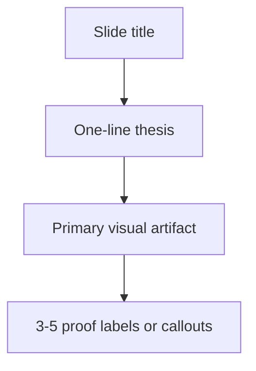

# ABL Client Presentation - Visual Design Thesis

## Design Thesis

The deck should feel like an executive walkthrough of a live operating system for transshipment flow management. It should not feel like a text-heavy proposal summary or a software feature inventory.

The visual language should make one idea clear at a time:

- The operation is interconnected.
- The constraint moves.
- The product governs planning decisions.
- Demo screens prove product readiness.
- The roadmap proves delivery discipline.

Text should support the visuals, not compete with them. Each slide should use one headline sentence, one primary visual artifact and a small number of labels or proof points.

## Presentation Personality

| Dimension | Direction |
| --- | --- |
| Tone | Operational, precise, senior, client-facing |
| Visual feel | Structured, navigational, system-led |
| Density | Low text density, high artifact density |
| Primary asset type | SVG diagrams, product screenshots, Gantt/timeline visuals |
| Avoid | Proposal text dumps, generic stock images, heavy tables, decorative gradients, internal build references |
| Demo treatment | Full-width product screenshots with controlled callouts |

## Slide Anatomy

Use a consistent slide structure.

| Area | Purpose | Guidance |
| --- | --- | --- |
| Top title | State the slide idea | 6 to 10 words, direct and active |
| Thesis line | Say the point in one sentence | One short sentence, no paragraph |
| Main visual | Carry the story | SVG, flow diagram, product screenshot or timeline |
| Proof labels | Clarify only what is needed | 3 to 5 short labels maximum |
| Speaker zone | Not visible on slide | Keep supporting detail in notes |

Recommended layout:

## Typography

Use a modern Office-safe font such as Aptos, Segoe UI or Arial. Avoid compressed, decorative or overly thin fonts.

| Text element | Recommended size | Weight | Notes |
| --- | ---: | --- | --- |
| Slide title | 34-40 pt | Bold | Keep titles short |
| Thesis line | 22-26 pt | Regular or Semibold | One sentence only |
| Diagram labels | 16-20 pt | Semibold | Must be readable from screen share |
| Screenshot callouts | 15-18 pt | Semibold | Use numbered tags and short phrases |
| Footer/context | 9-11 pt | Regular | Optional, low contrast |

## Color System

The deck should use a controlled operational palette. Avoid making the presentation entirely blue. Use color to separate stages and decision states.

| Use | Color | Hex |
| --- | --- | --- |
| Main header / authority | Deep navy | `#0B2948` |
| Blueprinting / base planning | Operational blue | `#2F7DBD` |
| Governed scheduling / Release 1 | Constraint green | `#2E7D32` |
| Scenario and recovery | Signal orange | `#E96500` |
| Pilot readiness / milestone | Amber | `#A9781A` |
| Body text | Ink | `#10233F` |
| Secondary text | Slate | `#4A5F78` |
| Background | Clean white | `#FFFFFF` |
| Soft panel | Light slate | `#F6F9FC` |
| Grid / rule | Cool grey | `#D9E2EC` |

State colors:

| State | Color direction |
| --- | --- |
| Planned | Blue |
| Observed | Slate |
| Confirmed | Green |
| Projected | Orange |
| Recommended | Amber |
| Blocked | Red accent used sparingly |

## Visual Grammar

### 1. Operating Flow Map

Use for Slides 1 and 2.

Design intent:

- Show the transshipment chain as a connected system.
- Do not show it as separate departments.
- Use constraint badges around the chain.

SVG elements:

- Left node: Berau Demand
- Center nodes: Cargo Readiness, Jetty/BLC, Tug-Barge, Tide/Bridge, CTS
- Right node: OGV Loading
- Constraint badges: tide, bridge, berth, cargo, fleet, CTS
- Thin directional connectors, not heavy arrows

### 2. Constraint Handoff Ribbon

Use for Slides 3 and 4.

Design intent:

- Make the CCR-based thinking intuitive without making the slide academic.
- Show that the limiting constraint can move during the day.

SVG elements:

- Horizontal ribbon of constraint nodes
- One active constraint highlighted
- Other constraints muted
- Output gate: feasible movement or blocker

Recommended visual phrase:

> Active constraint -> feasibility gate -> candidate movement / blocker

### 3. Vector Scaffolding Stack

Use for Slide 5.

Design intent:

- Position Vector's proprietary base as an implementation accelerator.
- Keep the client focus on configured operating value, not internal architecture.

SVG elements:

- Bottom layer: Scheduling base
- Middle layer: Scenario engine
- Middle layer: Dynamic constraint handling
- Top layer: ABL operating configuration
- Output layer: governed planning platform

Avoid showing code, repository references or engineering internals.

### 4. Product Flow Swimlane

Use for Slides 6, 9, 10 and 12.

Design intent:

- Show progression through governed steps.
- Make approvals and publish gates visible.
- Keep the flow simple enough to remember.

SVG style:

- Rounded rectangles with icons
- Thin connectors
- Gate icons for approval and publishability
- Lock icon for published snapshot
- Alert icon for exception

### 5. Application Module Map

Use for Slide 8.

Design intent:

- Help the client understand the product surface before the demo begins.
- Show modules as part of one operating cockpit.

SVG elements:

- Center: Operator cockpit
- Surrounding modules: Access, Master Data, Planning, Scheduling, Exception, Telemetry, Operations, Guided Workflow, Audit
- Highlight the modules about to be shown in Demo 1

### 6. Scenario Comparison Board

Use for Slide 11.

Design intent:

- Show why scenario simulation matters.
- Compare baseline with projected scenario without dense numbers.

SVG elements:

- Two horizontal lanes: Baseline Plan and Scenario
- Assumption tag: delay, outage, missed window or reassignment
- Output cards: trip impact, OGV risk, utilization, remaining blockers

### 7. Telemetry Monitoring Composition

Use for Slide 13.

Design intent:

- Demonstrate operational evidence and trust logic.
- Avoid giving the impression that raw pings rewrite the plan.

SVG/screenshot elements:

- Map area with asset markers
- Side panel with latest asset state
- Status chips: fresh signal, stale signal, ETA variance, geofence alert
- Event candidate panel
- Confirm/reject decision control

Key visual distinction:

> Observed evidence is separate from confirmed execution state.

### 8. Roadmap and Milestone Gantt

Use for Slide 14.

Design intent:

- Make delivery realistic and staged.
- Emphasize blueprinting and Release 1 validation before later layers.

Use existing visual artifact:

- `F:\ocean\docs\proposal\final_version\ABL_Program_Delivery_Timeline_Gantt_v2.svg`
- For Slide 14, crop or highlight Weeks 1-18.

Primary callouts:

- Blueprinting: Weeks 1-3
- Sprint 0 to Sprint 5: Weeks 4-16
- Release 1 review: Weeks 17-18

### 9. Client Alignment Board

Use for Slide 15.

Design intent:

- End with a clear readiness conversation.
- Avoid closing with a dense responsibility matrix.

SVG elements:

- Five readiness columns: Rules, Data, Users, Approvals, Integrations
- Each column has one owner icon and one validation check
- Bottom band: Build -> Operate -> Transfer -> Audit

## Demo Slide Treatment

The three demo stages should feel like product proof moments. They should not look like slide explanations of product features.

### Demo Stage 1 - Core App + Happy Path

Slides involved:

- Slide 8: modules and master data
- Slide 9: OGV demand to feasible schedule
- Slide 10: approval, publish and audit

Visual treatment:

- Start with one module map slide.
- Move quickly into product screens.
- Use large screenshots, not small thumbnails.
- Use numbered callouts only for the path being demonstrated.

Suggested callouts:

1. Demand intake
2. Cargo layer
3. Operating windows
4. Candidate schedule
5. Approval
6. Published snapshot

### Demo Stage 2 - Recovery + Scenario

Slides involved:

- Slide 11: scenario and exception flow
- Slide 12: recovery path to publish

Visual treatment:

- Use a baseline-versus-scenario visual before the demo.
- In the demo, keep the story anchored to one disruption.
- Show the flow from exception to ranked options to publish.

Suggested callouts:

1. Active exception
2. Recovery snapshot
3. Ranked options
4. Scenario validation
5. Approval
6. Recovery publication

### Demo Stage 3 - Telemetry + Evidence

Slides involved:

- Slide 13: telemetry evidence and operational monitoring

Visual treatment:

- Use one clean monitoring slide, then move to screens.
- Make map or asset positioning the visual center.
- Keep trust logic visible: observed, confirmed, actualized.

Suggested callouts:

1. AIS/GPS evidence
2. Latest asset state
3. Geofence or ETA variance
4. Event candidate
5. Confirmation
6. Actualized state

## Screenshot and Callout Rules

| Rule | Guidance |
| --- | --- |
| Screenshot size | Use at least 70 percent of slide width for demo screenshots |
| Callout count | 3 to 6 callouts maximum per screenshot |
| Callout shape | Small numbered circles with one-line labels |
| Highlighting | Use a translucent navy or green outline, not thick red boxes |
| Cropping | Crop to the decision surface being discussed |
| Background | Use white or very light slate, not dark panels behind screenshots |
| Internal language | Do not mention repository, local build, seed data or implementation internals |

## Slide-Specific Visual Guidance

| Slide | Primary visual | Text density | Notes |
| --- | --- | --- | --- |
| 1 | Operating flow map | Very low | Show the chain and moving constraints |
| 2 | Manual planning stress loop | Low | Use pain tags, not paragraphs |
| 3 | Constraint handoff ribbon | Very low | CCR lens through visual metaphor |
| 4 | Feasibility gate | Low | Inputs produce candidates or blockers |
| 5 | Vector scaffolding stack | Low | Proprietary base plus ABL configuration |
| 6 | End-to-end product flow | Very low | Icon-led horizontal flow |
| 7 | Release layer stack | Low | Release 1 as foundation |
| 8 | Module map plus screen frame | Low | Begin product familiarization |
| 9 | Happy-path flow plus screenshot | Low | Demo carries detail |
| 10 | Approval/publish gate plus screenshot | Low | Show governed execution contract |
| 11 | Baseline versus scenario board | Low | One disruption example |
| 12 | Recovery ladder plus screenshot | Low | Recovery to publish |
| 13 | Monitoring map/cockpit | Low | Evidence and confirmation logic |
| 14 | Gantt roadmap | Medium | Use only key callouts |
| 15 | Readiness board | Low | Close with decision alignment |

## What To Avoid

- Do not paste proposal paragraphs into slides.
- Do not use dense tables except where a roadmap requires structure.
- Do not show code, repository paths or internal implementation rationale.
- Do not over-explain CCR or theory language.
- Do not make the product look like a fleet-tracking map only.
- Do not imply raw telemetry automatically updates the published plan.
- Do not mix too many colors on the same slide.
- Do not place multiple screenshots on one slide unless they form a clear sequence.

## Recommended Asset Set

Create or reuse the following assets before building the deck:

| Asset | Format | Used on slides |
| --- | --- | --- |
| Operating flow map | SVG | 1 |
| Planning stress loop | SVG | 2 |
| Constraint handoff ribbon | SVG | 3 |
| Feasibility gate | SVG | 4 |
| Vector scaffolding stack | SVG | 5 |
| Product concept flow | SVG | 6 |
| Release layer stack | SVG | 7 |
| Module map | SVG | 8 |
| Happy-path flow | SVG | 9 |
| Approval/publish gate | SVG | 10 |
| Scenario comparison board | SVG | 11 |
| Recovery path ladder | SVG | 12 |
| Telemetry monitoring composition | SVG + screenshot | 13 |
| Delivery Gantt | Existing SVG | 14 |
| Readiness board | SVG | 15 |

## Final Build Principle

The client should leave the presentation with three ideas:

1. The operating problem is a moving-constraint synchronization problem.
2. Vector's product approach converts that problem into governed scheduling, scenario and recovery workflows.
3. The delivery plan validates the scheduling spine first, then progressively adds scenario, telemetry and recovery capability.
