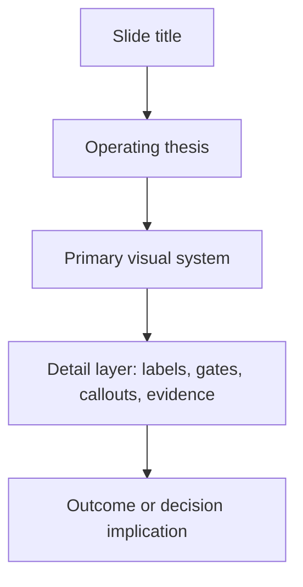

# ABL Client Presentation - Visual Design Thesis v2

## Design Thesis

The presentation should feel like an executive walkthrough of a serious operating platform for coal transshipment synchronization. The subject is operationally intense: demand commitments, cargo readiness, jetty operations, tide and bridge windows, tug-barge movement, CTS capacity, OGV loading pressure, exceptions, recovery and adoption are all connected. The deck should therefore be visually disciplined, but not artificially sparse.

The design principle is controlled density:

- Use visuals as the main organizing device.
- Use text where it carries operating meaning.
- Preserve enough labels, legends, sequence steps and decision rules for the client to understand the logic without over-relying on spoken explanation.
- Avoid text dumps, but do not remove useful operating detail merely to appear minimal.

The deck should make the proposal feel like a productized operating method, not a generic software pitch.

## Presentation Personality

| Dimension | Direction |
| --- | --- |
| Tone | Senior, operational, precise, grounded in transshipment realities |
| Visual feel | System-led, constraint-aware, product-led, decision-oriented |
| Content density | Medium to high where the operating logic requires it; low only for framing and transition slides |
| Primary assets | SVG diagrams, workflow maps, product cockpit visuals, timeline/Gantt, release layer visuals |
| Proof style | Operating flow, constraint logic, governed workflow, product modules, demo sequence and delivery roadmap |
| Avoid | Decorative minimalism, empty whitespace, generic SaaS cards, proposal paragraphs pasted into slides |

## Core Design Position

The deck must carry three layers of meaning at the same time:

1. **Business reality:** ABL's operation is dynamic, interconnected and repeatedly constrained by moving operating windows.
2. **Operating method:** The solution is based on synchronized flow, active constraint visibility and governed planning decisions.
3. **Product proof:** The platform turns that method into modules, screens, workflows, approvals, evidence and recovery paths.

Each slide should answer one of these questions:

- What is happening in the operation?
- What is limiting the flow?
- What does the product do about it?
- What will the client receive at this stage?
- What must be aligned for adoption?

## Slide Anatomy

Use a consistent but flexible slide architecture.

| Area | Purpose | Guidance |
| --- | --- | --- |
| Title | Names the topic | 5 to 10 words, direct and specific |
| Thesis line | States the slide's operating point | One sentence; can be longer when the logic is complex |
| Main visual | Carries the structure | Diagram, product screen, flow map, timeline or cockpit frame |
| Detail layer | Explains the operating mechanics | Labels, sequence steps, legends, constraints, decision gates, callouts |
| Speaker emphasis | Supports the slide | Keep deeper rationale in speaker notes or oral narration |

Recommended composition:

## Density Rules

The deck should not use the same density level everywhere. Match content density to topic intensity.

| Slide type | Density level | Visual guidance | Text guidance |
| --- | --- | --- | --- |
| Opening context | Medium | System map or operating chain | Enough labels to show the full transshipment chain |
| Problem framing | Medium | Stress loop or friction map | Use pain labels and concise consequence statements |
| Root cause / CCR lens | Medium | Constraint handoff ribbon | Include active constraint, flow capacity and synchronization terms |
| Operating philosophy | Medium-high | Feasibility gate | Show inputs, gate logic and output states |
| Vector approach | Medium | Layered scaffolding stack | Explain what is proprietary base vs ABL configuration |
| Product concept | Medium-high | End-to-end workflow | Keep all major steps visible |
| Release 1 layer | Medium-high | Product layer map | Show system screens, capabilities and product outcome |
| Demo blocks | Medium-high | Product screenshots with callouts | Use numbered callouts and screen-specific labels |
| Telemetry / evidence | High | Monitoring cockpit plus trust-state flow | Use observed, confirmed, actualized and projected state labels |
| Delivery roadmap | High | Gantt or release map | Show weeks, sprint blocks, release gates and review milestones |
| Client alignment | Medium | Readiness board | Use owner/action labels, not paragraphs |

## Typography

Use a modern Office-safe font such as Aptos, Segoe UI or Arial. The deck will often be viewed over a screen share, so labels must be readable without zooming.

| Text element | Recommended size | Weight | Usage |
| --- | ---: | --- | --- |
| Slide title | 34-40 pt | Bold | Main slide heading |
| Thesis line | 22-28 pt | Semibold | Key point under the title |
| Diagram node labels | 16-21 pt | Semibold | Flow nodes, constraints, product modules |
| Operational detail labels | 13-16 pt | Regular/Semibold | Legends, state chips, schedule tags |
| Screenshot callouts | 15-18 pt | Semibold | Demo labels and numbered annotations |
| Timeline labels | 12-16 pt | Semibold | Weeks, sprint names, release markers |
| Footer | 9-11 pt | Regular | Low-emphasis context only |

## Color System

The color system should encode operating meaning. Do not use color as decoration only.

| Use | Color | Hex |
| --- | --- | --- |
| Main authority / header | Deep navy | `#0B2948` |
| Blueprinting / planning base | Operational blue | `#2F7DBD` |
| Governed scheduling / validated flow | Constraint green | `#2E7D32` |
| Scenario, exception and recovery | Signal orange | `#E96500` |
| Pilot readiness / commercial milestone | Amber | `#A9781A` |
| Risk / blocker accent | Controlled red | `#BA2D2D` |
| Body text | Ink | `#10233F` |
| Secondary text | Slate | `#4A5F78` |
| Panel background | Light slate | `#F6F9FC` |
| Grid / rule | Cool grey | `#D9E2EC` |

State colors:

| State | Color direction | Meaning |
| --- | --- | --- |
| Planned | Blue | Approved or intended schedule state |
| Observed | Slate | Signal or evidence, not yet operational truth |
| Confirmed | Green | Trusted field event that updates execution state |
| Projected | Orange | Scenario or future impact estimate |
| Recommended | Amber | Candidate action for review |
| Blocked | Red | Hard conflict or unresolved feasibility issue |

## Diagram Language

Use a small, consistent set of visual primitives.

| Primitive | Meaning | Design rule |
| --- | --- | --- |
| Rounded node | Operating object or product module | Use concrete labels, not generic terms |
| Directional connector | Sequence or dependency | Use only when order or dependency is real |
| Gate | Validation, approval or publishability check | Use sparingly and clearly |
| Badge / chip | Constraint, state or milestone | Keep labels short but meaningful |
| Lane | Parallel state, party or workflow | Use for baseline vs scenario, planned vs observed |
| Stack | Product layer or build scaffolding | Use for Vector base and ABL configuration |
| Map/cockpit frame | Product proof surface | Use in demo sections |

Avoid connectors that imply a sequence where none exists. Every arrow should mean either time, dependency, decision flow or data/evidence movement.

## Slide-Specific Visual Guidance

| Slide | Primary visual | Density | Design guidance |
| --- | --- | --- | --- |
| 1. Proposal Context & Operating Reality | Operating flow map | Medium | Show full chain from Berau demand to OGV loading, with moving constraint badges |
| 2. Problem Statement | Planning stress loop | Medium | Show manual coordination loop and consequence labels |
| 3. Root Cause Perspective | Constraint handoff ribbon | Medium | Show active constraint shifting across the operating chain |
| 4. Core Operating Philosophy | Feasibility gate | Medium-high | Show inputs, validation logic, feasible candidates and blockers |
| 5. Vector Approach & Proprietary Scaffolding | Layered platform stack | Medium | Show Vector base, scenario engine, dynamic constraints and ABL configuration |
| 6. Product Concept | End-to-end workflow | Medium-high | Show demand-to-publish and evidence-to-recovery in one flow |
| 7. Release 1 Product Layer | Product layer map | Medium-high | Show Release 1 screens and capability boundaries |
| 8. Application Modules & Master Data Spine | Module map | Medium-high | Use module ecosystem around operator cockpit |
| 9. OGV Demand To Feasible Schedule | Product screen plus flow | Medium-high | Pair screen frame with happy-path sequence |
| 10. Approval, Publish & Audit Trail | Governance gate flow | Medium-high | Make approval and immutable published snapshot visible |
| 11. Scenario & Exception Flow | Baseline vs scenario board | Medium-high | Show assumption, projected impact and promotion logic |
| 12. Recovery Path To Publish | Recovery ladder | Medium-high | Show every governed transition from exception to publication |
| 13. Telemetry Evidence & Operational Monitoring | Monitoring cockpit | High | Show asset state, event trust and actualization separation |
| 14. Delivery Roadmap: Release 1 Focus | Gantt / sprint map | High | Show weeks, sprints, release validation and adoption review |
| 15. Adoption Review & Client Alignment | Readiness board | Medium | Show rules, data, users, approvals and integrations |

## Opening Slides Design Guidance

The opening section should feel strategic but grounded.

Design priorities:

- Use transshipment-specific labels.
- Show operational interdependence visually.
- Use the CCR-based lens as a practical operating logic, not as theory-heavy teaching.
- Keep the client anchored on the business problem: synchronizing demand commitments with executable flow capacity.

Recommended visuals:

- Operating flow map
- Manual planning stress loop
- Constraint handoff ribbon
- Feasibility gate

## Demo Block Design Guidance

The product demonstration blocks should feel like guided proof, not a separate live-demo interruption. Each demo block should start with a visual anchor slide that prepares the viewer for what will be shown in the product.

### Demo Block 1 - Core App + Happy Path

Purpose:

- Familiarize the client with application modules and master data.
- Demonstrate how OGV demand moves through the happy path into schedule generation, approval and publish.

Visual guidance:

- Use product cockpit frames and module maps.
- Show screen groups as part of one governed application, not isolated features.
- Use numbered callouts for the demo sequence.

Required callouts:

1. Master data and roles
2. OGV demand intake
3. Cargo layer sequence
4. Operating windows
5. Candidate movements
6. Approval and publish
7. Audit and export

### Demo Block 2 - Scenario + Recovery

Purpose:

- Show how disruption is handled through governed scenario logic.
- Demonstrate recovery all the way to publish.

Visual guidance:

- Use baseline-versus-scenario lanes.
- Show exception as an operating object with family, cause, affected movement and recovery linkage.
- Show ranking and proof pack as decision support, not automatic plan change.

Required callouts:

1. Active exception
2. Recovery input snapshot
3. Ranked recovery options
4. Scenario run
5. Publishability review
6. Approval
7. Recovery plan publication

### Demo Block 3 - Telemetry Evidence + Monitoring

Purpose:

- Show how asset signals and event evidence support planning and recovery.
- Clarify that raw telemetry is evidence, not automatic truth.

Visual guidance:

- Use a cockpit/map composition.
- Use state labels: planned, observed, confirmed, projected, recommended.
- Make signal freshness, geofence, ETA variance and event confirmation visible.

Required callouts:

1. AIS/GPS evidence
2. Latest asset state
3. Geofence or ETA variance
4. Event candidate
5. Confirm/reject decision
6. Actualized execution state

## Roadmap Design Guidance

The roadmap section should be high-density and decision-oriented. The client should clearly understand what it receives at each block and why the sequence matters.

Design priorities:

- Blueprinting is the first actual activity and must be clearly separated from Sprint 0.
- Sprint 0 begins from Week 4.
- Release 1 review/adoption should be visible as a milestone, not hidden inside the sprint bar.
- Later release logic should be shown as dependent on Release 1 validation.

Roadmap visuals should include:

- Weeks
- Sprint numbers
- Release blocks
- Review/adoption gates
- Product outcome at each stage
- External integration risk note where relevant

## Screenshot and Product Frame Rules

| Rule | Guidance |
| --- | --- |
| Screenshot size | Large enough for screen-share readability |
| Callout count | 4 to 7 for complex product screens; fewer for simple screens |
| Callout style | Numbered marker plus short operating label |
| Highlighting | Use navy, green or orange outlines aligned to state meaning |
| Cropping | Crop to the decision surface being discussed |
| Legends | Include when state colors or event trust levels are used |
| Demo transition | Use slide visual as setup, then move into product demo |

Do not let screenshots become decorative background. Each screenshot must prove a workflow, decision surface or readiness level.

## Use Of Text

Text is acceptable when it performs one of these jobs:

- Names an operating object.
- Defines a constraint or state.
- Explains a decision gate.
- Shows a workflow step.
- Identifies a product module.
- Captures a sprint or release outcome.
- Clarifies adoption responsibility.

Text should be avoided when it is:

- A proposal paragraph pasted into the deck.
- A repeated restatement of the title.
- A generic software benefit.
- A label that could apply to any product.
- Decorative filler.

The standard is not minimalism. The standard is useful operating clarity.

## Asset Set To Build

| Asset | Format | Used on slides |
| --- | --- | --- |
| Operating flow map | SVG | 1 |
| Planning stress loop | SVG | 2 |
| Constraint handoff ribbon | SVG | 3 |
| Feasibility gate | SVG | 4 |
| Vector scaffolding stack | SVG | 5 |
| Product concept flow | SVG | 6 |
| Release 1 product layer map | SVG | 7 |
| Application module map | SVG | 8 |
| Happy-path product flow | SVG / editable PPT shapes | 9 |
| Approval and publish gate | SVG / editable PPT shapes | 10 |
| Scenario comparison board | SVG / editable PPT shapes | 11 |
| Recovery ladder | SVG / editable PPT shapes | 12 |
| Telemetry monitoring cockpit | SVG plus screenshot/product frame | 13 |
| Delivery roadmap Gantt | SVG / editable PPT shapes | 14 |
| Client readiness board | SVG / editable PPT shapes | 15 |

## What To Avoid

- Do not simplify the operation so much that the client cannot see the real constraints.
- Do not use generic architecture boxes such as "data", "platform", "AI" or "workflow" without ABL-specific meaning.
- Do not make the deck look like a software brochure.
- Do not over-teach CCR or Theory of Constraints.
- Do not imply raw telemetry automatically updates the plan.
- Do not hide approval, publishability or audit gates.
- Do not make the roadmap a decorative timeline without deliverable meaning.
- Do not expose internal repository, build rationale or critique history.

## Final Build Principle

The presentation should help the client see that:

1. The ABL operating problem is a moving-constraint synchronization problem.
2. Vector's approach converts that problem into governed scheduling, scenario, telemetry and recovery workflows.
3. The product demonstration proves the operating logic through modules, master data, happy path, recovery and monitoring.
4. The delivery roadmap validates Release 1 first, then expands into scenario, live evidence and recovery capability.
